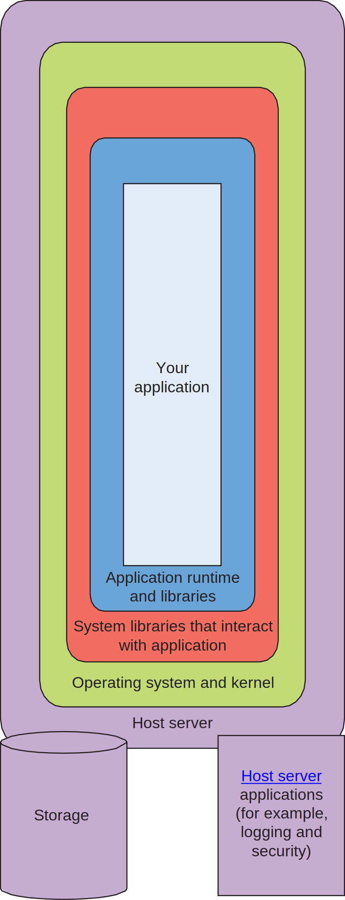
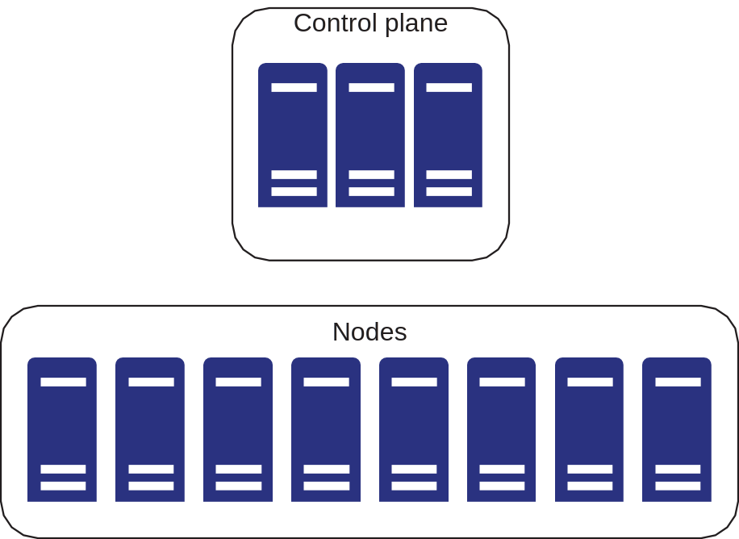
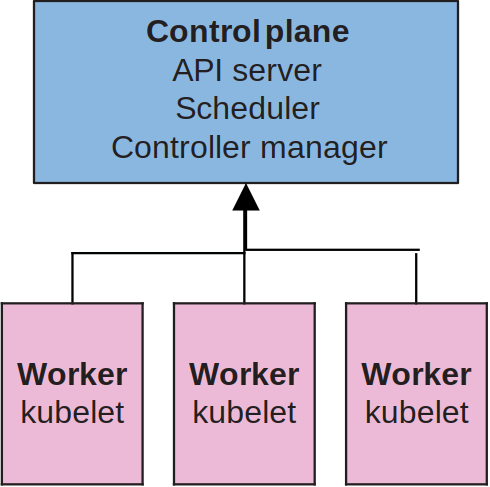

# Ch1. Kubernetes 为何存在

## 术语

- CNI 和 CSI：分别为容器网络和存储接口。 它允许在 Kubernetes 中运行的 Pod（容器）的可插拔网络和存储。
- 容器 Container：Docker 或 OCI 镜像，通常运行一个应用程序。
- 控制平面 Control plane：是 Kubernetes 集群的大脑，它调度所有的容器和 Kubernetes 对象（有时被称为 Masters）。
- Deployment：由 Kubernetes 管理的 Pod 的集合。
- DaemonSet：类似 Deployment，但它在集群的每个节点上都有一个在运行。
- kubectl：用于与 Kubernetes 控制平面对话的命令行工具。
- kubelet：工作节点上的一个代理组件，运行在每个节点上。控制平面让它做什么就做什么。
- 节点：运行一个 kubelet 进程的机器。
- OCI：通用镜像格式，用于构建可执行的、独立的应用程序。也指 Docker 镜像。
- Pod：Kubernetes 对象，封装正在运行的容器（通常是 1 个）。

## 基础设施漂移问题

对于基础设施的管理，即使面临承载应用架构的硬件、合规性和数据中心的变化，也应该具备一套可重复性的方法。例如这些场景：Java 版本升级、替换硬件时应用程序进程迁移到其他机器、手动管理负载均衡，等等，这些都会增大漂移的概率，即实际的架构偏离了最初所预期的形态。

Puppet、Chef、Mesos、Ansible 和 SaltStack 等技术为解决这些问题应运而生。Kubernetes 也借鉴了这些技术，它在 Linux 环境中使用特权容器。例如，Linux 系统中的特权容器可以管理 iptables 规则，以便将流量路由到应用程序（这正是 Kubernetes 服务代理 kubeproxy 的工作）。

## 容器与镜像

容器遵循 [OCI 规范](https://github.com/opencontainers/image-spec)，它可以解决如“这个应用程序在我机器上能运行，但是在另一台机器上就不行”的问题。

容器的结构（由内到外）：

- 应用程序
- 应用程序依赖的运行时和库
- 与应用程序交互的系统库
- 操作系统与内核
- 主机服务器
  - 存储设备
  - 主机上其他应用程序，如日志、安全服务等

## Kubernetes 的基础特性

Kubernetes 中的一切对象可由纯文本文件定义。例如通常我们用 YAML 或 JSON，以声明的方式来运行你的 OCI 镜像、设置网络规则或 RBAC。

Kubernetes 是一个最终一致的系统。当我们通过 Kubernetes API 向集群发起了一个“拉取某个应用程序的镜像并运行的 Pod”请求，这个资源创建过程可能会遇到各种问题，比如拉取镜像失败或者节点间通信故障等。这种最终一致性模型（与保证一致性模型相比）确保我们可以不断地请求改变我们集群中所有应用程序的整体状态空间，让 Kubernetes 底层平台知晓这些应用程序如何随着时间的推移被设置。

> 例 1. 如果你告诉 Kubernetes："我想要五个应用程序分布在云中的三个区域"，这完全可以通过定义几行 YAML，利用 Kubernetes 的调度原语来完成。当然，你需要确保这三个区域确实存在，并且你的调度器知道它们，但即使你没有这样做，Kubernetes 至少会在可用的区域中调度一些工作负载。
>
> 例 2. 集群中的一个典型故障场景:
>
> 1. 一个节点停止对控制平面的响应。
> 2. 控制平面将运行在无响应节点（故障节点）上的 Pods 重新安排到另一个或多个节点上。
> 3. 当用户通过 `kubectl` 对 Kubernetes 进行 API 调用时，API 服务器会响应关于故障节点的真实信息以及 Pod 的新位置。
> 4. 所有与 Pod 上的服务进行通信的客户端都被重定向到它的新位置。
> 5. 先前挂载在故障节点上的 Pod 的存储卷也跟随被移动到新的 Pod 位置上，从而保证其旧数据仍然可以读取。

## Kubernetes 的架构

**主旨：Kubernetes 中绝大部分事物都是为了支持 Pod 而存在的。**

Kubernetes 的大致架构：

- 硬件基础设施：包括计算机、网络和存储基础设施、容器仓库
- 工作节点
- 控制平面：包括 API 服务器、调度器、Controller 管理器和其他控制器

kubectl 是方便用户跟 API 服务器交互的命令行工具，当然也可以以编程方式连接到 API 服务器。所有 Kubernetes API 对象都有：

- API 版本 (例如 `v1` 或 `rbac.authorization.k8s.io/v1`)
- 种类 (for example, `kind: Deployment`)
- 元数据

通过命令 `kubectl api-resources | head` 可以查看 Kubernetes 集群内所有 API 类型。

## Kubernetes 不适用的场景

- 高性能计算（HPC）：容器增加了一层复杂性，这一层会带来性能上的影响。Kubernetes 不适合服务纳米或微秒级应用程序。
- 遗留问题：一些应用程序有硬件、软件和延迟要求令其难以简单地被容器化。例如，你有一套从一家软件公司购买的应用程序，而该公司没有正式支持在容器中运行或在 Kubernetes 集群中运行该应用程序。
- 迁移：比起迁移老系统这件事本身，一些更重要的收益是在迁移之后，当单体应用被解析为组件时，它们就可以独立地进行扩展 。
