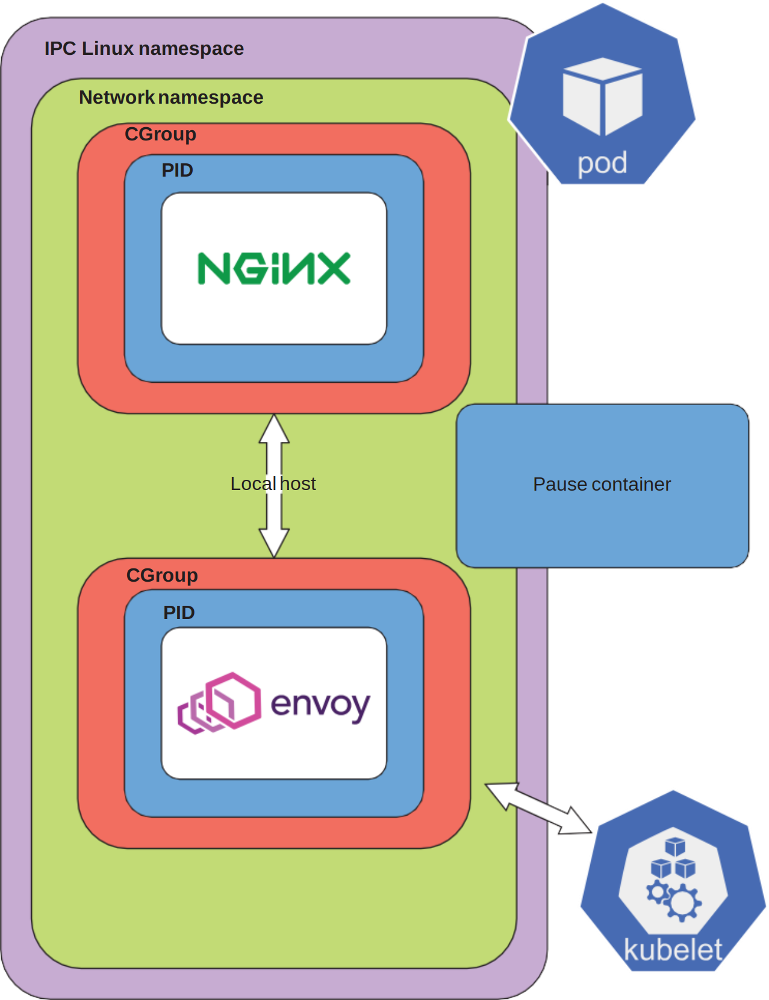
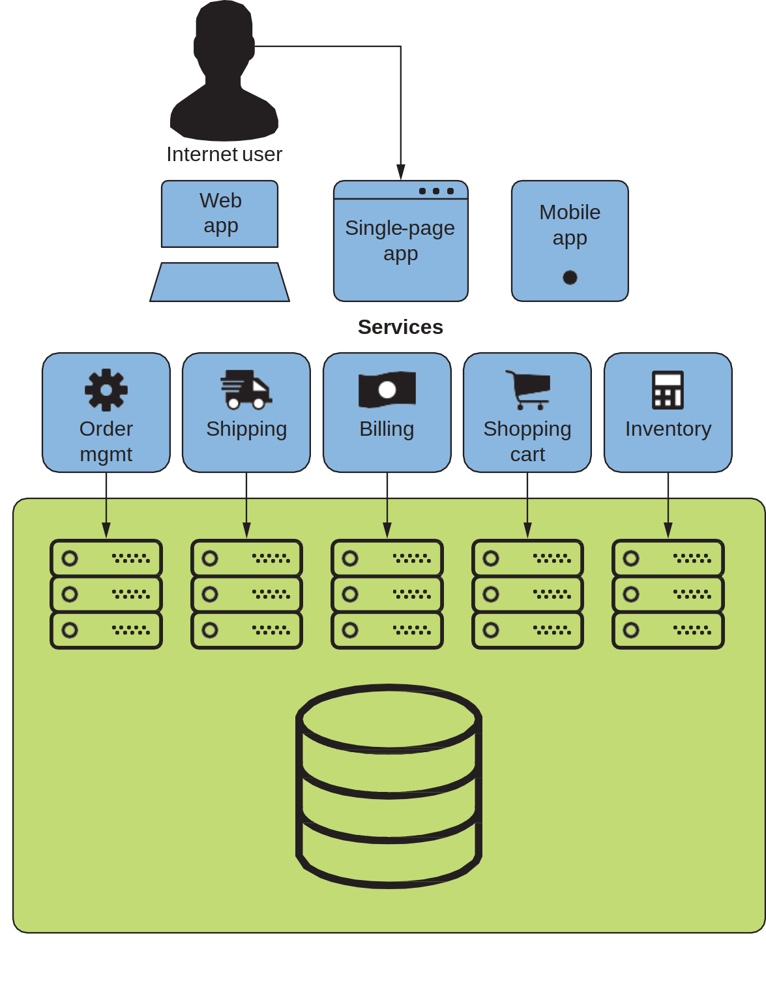
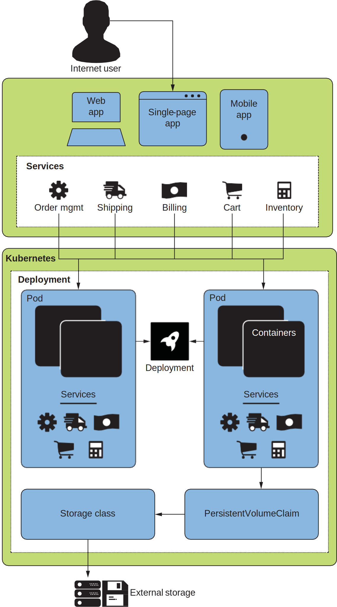
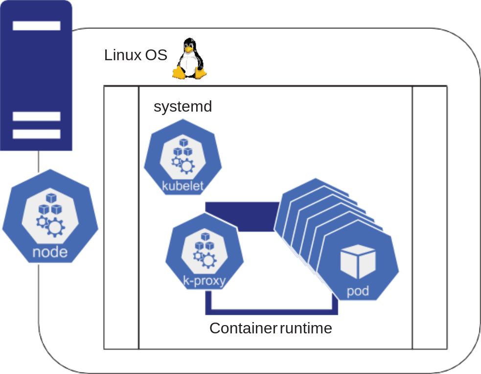
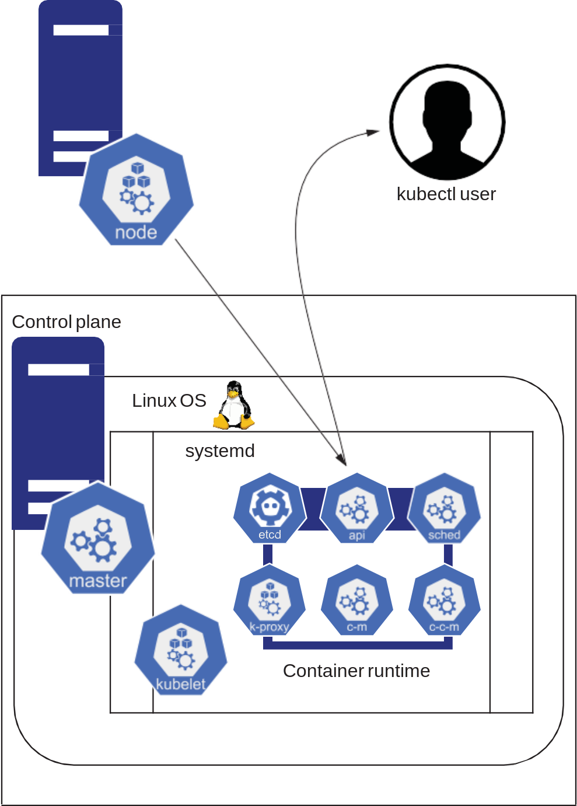
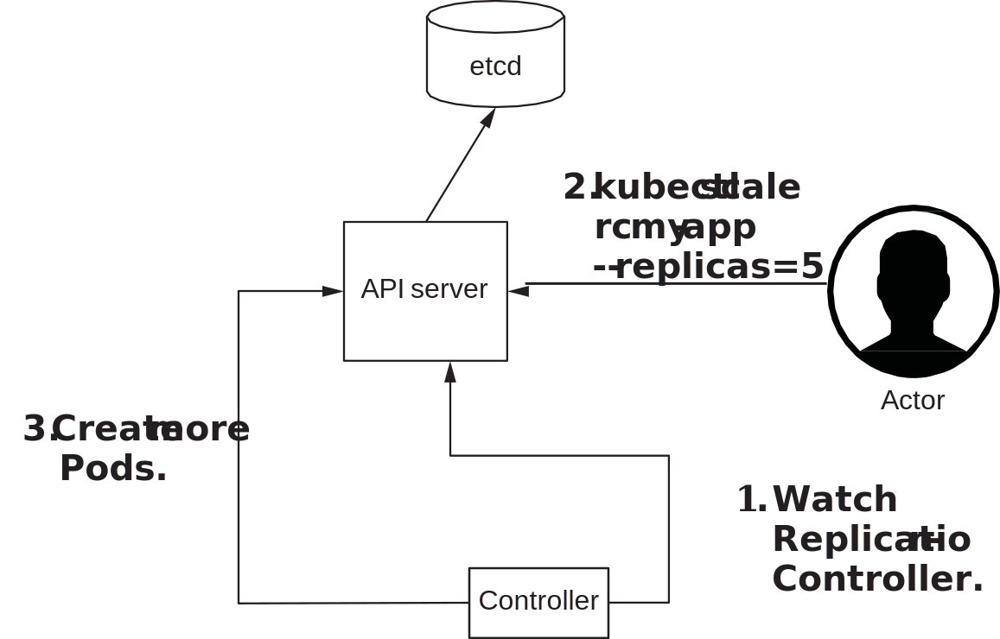

# Ch2. 为什么是 Pod

Pod 是可以部署到 Kubernetes 集群中的最小原子单元。Kubernetes 是围绕着 Pod 的定义建立的。



_Figure 2.1 A Pod_

## 一个网络应用的例子



_Figure 2.2 A web application architecture_

如图 2.2 展示了一个网络应用架构，它包含：

- NGINX 服务的 JS 前端单页面应用
- 一些独立的 Django 微服务
- 一个监听 6379 端口的数据库 CockroachDB，外挂存储

假如这些前端应用、微服务和数据库都由各自的一个 container 包装起来并运行，会遇到以下一些问题：

- 只能有一个 NGINX 服务的 JS 前端应用实例，因为只有一个 80 端口。如果要有多个实例的话需要一个负载均衡器。
- CockroachDB 容器不能轻易迁移到其它服务器上，因为一旦改动，微服务代码里面的数据库地址也得跟着改。或者，需要一个 DNS 服务器，当 CockroachDB 容器移动时动态更新。
- 为保证 CockroachDB 的高可用性，需要几台服务器，每台服务器上跑一个 CockroachDB 实例。
- 如果一个 CockroachDB 实例在一台服务器上挂了，他们需要一种方法来移动其数据到一个新的节点，并回收未使用的存储空间。
- 共享网络的上百个进程之间都绑定在同一个端口上。
- 在迁移并解耦存储卷和应用程序的同时，避免弄脏本地存储。
- 优化可用的 CPU 和内存资源的利用，以节约成本。
- 调度要求 1：Storage-aware scheduling——在调度一个进程的同时，要保证其数据是可用的。
- 调度要求 2：Service-aware network load balancing——把容器从一台机器迁移到另一台的过程中，需要把原本打到该容器上 IP 的流量重定向到别的 IP 上。

> 在服务器上运行更多的进程经常会导致近邻干扰现象（noisy neighbor phenomenon）：大量应用程序的同时运行会导致对稀缺资源（CPU、内存）的过度竞争。一个系统必须减轻这种现象的影响。

为了解决上述问题，我们需要：

- 部署
  - 虚拟机或物理机构成的部署平台
  - 负载均衡器
  - 服务发现
  - 存储
  - 一套安全系统
- DevOps
  - 中心化日志
  - 监控、告警和指标
  - CI/CD 系统
  - 备份
  - 密钥管理
- 业务需求
  - 缩放
  - 高可用性
  - 支持回滚的应用程序版本控制
  - 成本管理

## Pod 是什么

粗略来讲，一个 Pod 里包含一个或多个作为容器运行的 OCI 镜像并运行在一个 Kubernetes 节点（node）上。

### 高级 Kubernetes API



_Figure 2.3 The web application running on Kubernetes_

许多 Kubernetes API 对象要么直接使用 Pod，要么是支持 Pod 的 API 对象，如：

- Deployment：管理若干个相同 Pod 的 API 对象，常用于部署一个微服务
- Jobs：作为一个批处理程序运行一个 Pod
- StatefulSets：托管有状态应用的一个 API 对象，如数据库，其中每个 Pod 都是有序命名的，从而建立存储和 Pod 的绑定关系，实现按序启动、缩放和升级等
- DaemonSets：每个节点上都保证有一个的 API 对象，如日志程序。

所以通常我们会借助上述 API 对象来部署服务到 Pods 上，而非直接使用 Pod。

> Tip: 在创建上述对象过程中需要指定容器镜像名称时，永远显式声明镜像版本号，否则默认是 latest。Friends don’t let friends run _latest_!

### Linux namespaces

Kubernetes 命名空间和 Linux 命名空间不同，但 Pod 依托于后者。Linux 命名空间不但提供 Pod 运行容器的能力，以及纵向扩展（即调整资源大小以控制成本）的能力，其网络命名空间还提供给 Pod 横向扩展和负载均衡的能力。

### Kubernetes 基础设施与 Pod



_Figure 2.4 A node_

Kubernetes 节点的定义是一台运行一套 Kubernetes 组件的服务器，具体地，它的组成部分包含：

- 一台服务器，运行着 OS
- systemd（一个 Linux 系统和服务管理器）
- kubelet（一个节点代理）
- 容器运行时（Docker 或 Containerd 引擎）
- 一个处理 Kubernetes 服务的网络代理（kube-proxy）
- 一个 CNI provider（即容器网络接口驱动）

kubelet 实质是 CNI 驱动（provider）和实现 CRI 的容器运行时（container runtime）的协调角色（注意 CNI 和 CRI 都只是接口），它确保：

- 任何调度到 kubelet 主机的 Pod 都是通过一个控制循环（control loop）运行的，该循环观察哪些 Pod 被调度到哪些节点。
- 向 Kubernetes API 服务器报告心跳
- 垃圾回收：包括易失性存储或网络设备

Service 是另一个 Kubernetes API 对象，其创建由 kube-proxy 接管，类型包括：

- ClusterIP：集群内部的服务，一些内部请求打向这个 IP 后，Service 会将它们均衡负载到它所负责的 Pods 上
- NodePort：在节点上开个端口，请求打向 `<节点IP>:<节点端口>` 后，就可以从集群的外部访问这个服务，再均衡负载到它所负责的 Pods 上
- LoadBalancer：外部流量打到一个外部的服务上，这个外部服务再转发所有流量到 Pods 上。例如 AWS 或 GKE 会利用它们的 Load Balancer 服务来接管流量，然后分配到集群中该服务所涵盖的 Pods 上。这通常是对外暴露服务的标准方式。

内部服务都可以借助 `kubectl proxy` 来将其对外暴露。一些 CNI provider 可能会用自己的软件基础设施来取代 kube-proxy 实现这些功能，这样做可以避免使用 iptables。

### API 对象：Node

API 对象 Node 的 YAML 定义里会描述以下信息：

- 节点服务器信息：名字、操作系统、CPU 架构、Kubernetes 组件版本号等
- 状态
  - 节点状态
  - 心跳信息
  - 总的和可用的资源，包括 CPU、内存、Pod 数量
- 在运行的镜像名称、版本和大小
- 使用的 CRI socket，例如 `/run/containerd/containerd.sock`，它表示这是一个 containerd socket
- podCIDR：Pod 使用的 IP 段，CIDR 地址块的大小对应于每个节点的最大 Pod 数量

回过头来看，镜像被部署到一个节点的 Pods 上，其生命周期由 kubelet 管理。Service 对象一般由 kube-proxy 管理。像 CoreDNS 这样的 DNS 系统提供服务发现，它可以让一个 Pod 中的微服务查询另一个运行 CockroachDB 的 Pod 的 IP 从而与其通信。kube-proxy 有负载均衡的能力，帮助故障切换、升级、保证可用性和缩放。至于数据库对持久化存储的需求，`mnt` Linux 命名空间、kubelet 和节点本身的组合允许存储卷挂载到一个 Pod 上，当 kubelet 创建 Pod 时，该存储就会被挂载到 Pod 上。

### 网络应用与控制平面


_Figure 2.5 The control plane_

高可用需求意味着服务要履行服务级别协议（service-level agreement, SLA），以及别的需求：缩放、节约成本、容器版本控制、用户和应用安全。这些需求 Kubernetes 都能做到。

> SLA 用含若干个 9 的百分比表示，例如 99.999%的上线时间，它相当于 1 年中服务不可用时间不能超过 5 分钟 15 秒，折合每月只有不到半分钟的下线时间。

首先要做到的是 Pods 的置备（provisioning）。除此之外，Kubernetes 的控制平面不但可以提供容错性和可扩展性，还能节省成本。

## 控制平面的组件

当你执行 `kubectl apply` 时，kubectl 与控制平面进行通信时的第一个组件就是 API 服务器。

### Kubernetes API 服务器: kube-apiserver

**kube-apiserver 是一个基于 HTTP 的 REST 服务器**，为 Kubernetes 集群提供各种 API 对象。API 服务器必须能故障转移并具备高可用性，所以 kube-apiserver 由多个节点构成，挂在 HAProxy 或云负载平衡器后面。

控制平面上的所有组件也与 kube-apiserver 通信，它们都有一个控制循环，循环内可以**监视 API 服务器上的对象变化**。

API 服务器是控制平面上**唯一与 etcd（Kubernetes 的数据库）进行通信的组件**，而它本身是无状态的。

保证 API 服务器的安全至关重要。**准入控制器（Admission Controllers）是 API 服务器的一部分**，它会在处理请求之前认证和鉴权（authentication and authorization）。外部的认证和鉴权一般采用 webhook。

### Kubernetes 调度器: kube-scheduler

Kubernetes 分布式调度器（kube-scheduler）提供了一个干净、简单的调度实现，**调度过程中考虑的因素包括节点上的硬件、可用的 CPU 和内存资源、调度策略约束（Node 污点、Pod 亲和性、`nodeSelector` 和 `nodeName` 等）以及其他加权因素**。Pod 的生命周期由 kubelet 控制着 Pod 的生命周期，它就像一个节点的迷你调度器 。

**控制平面与不运行控制平面组件的节点完全分离**。即使控制平面发 生故障，应用程序也可以继续运行，数据也不会丢失。

### 基础设施控制器

一个软件可以包含若干个 API 对象，往往不会用一堆 YAML 文件来管理，而是使用 **Operator 模式**。例如一个 CockroachDB 数据库应用可能包含 StatefulSets、PV/PVC、Services 等等资源，推荐的安装和管理方式是请求创建 CockroachDB 的 Operator。Operator 是一种自定义资源，所以在此之前要先安装 CockroachDB 的定制资源定义（Custom resource definitions, CRD）。CRD 是用户自定义的新的 API 对象的规范（本质上本身还是一个 API 对象）。

```shell
$ # Installs the custom resource definition utilized by the Operator
$ kubectl apply -f https://raw.githubusercontent.com/ cockroachdb/cockroach-operator/master/install/crds.yaml

$ # Installs the Operator in the default namespace
$ kubectl apply -f https://raw.githubusercontent.com/ cockroachdb/cockroach-operator/master/install/operator.yaml
```

安装完 CRD 和 Operator 后，就可以安装应用本身了，例如 CockroachDB 提供的示例定义，就像配置文件一样，允许配置 TLS、资源限制、镜像版本和存储配置等：

```YAML
apiVersion: crdb.cockroachlabs.com/v1alpha1
kind: CrdbCluster
metadata:
  name: cockroachdb
spec:
  dataStore:
    pvc:
      spec:
        accessModes:
          - ReadWriteOnce
        resources:
          requests:
            storage: "60Gi"
        volumeMode: Filesystem
  resources:
    requests:
      cpu: 500m
      memory: 2Gi
    limits:
      cpu: 2
      memory: 8Gi
  tlsEnabled: true
  image:
    name: cockroachdb/cockroach:v22.1.3
  nodes: 3
  additionalLabels:
    crdb: is-cool
```

### 云控制器管理器 cloud-controller-manager (CCM)

cloud-controller-manager 组件是基于一种插件机制来构造的，这种机制类似依赖注入，使得不同的云厂商都能将其平台与 Kubernetes 集成。

这个组件的目的是运行云相关的控制器循环（调用相应云服务商的 API）：

- 节点控制器
  1.  使用从云平台 API 获取的对应服务器的唯一标识符更新 Node 对象
  2.  利用特定云平台的信息为 Node 对象添加注解（annotation）和标签（label）
  3.  获取节点的网络地址和主机名
  4.  检查节点的健康状况
- 路由控制器：在底层云基础设施中设置路由
- 服务控制器：增删改查 Service 对象 LoadBalancer 类型，即云提供商提供的负载均衡器（LoadBalancer 类型本身是抽象的，需要云服务商来实现）
- 卷控制器：增删改查卷

类似的接口还有：

- 容器网络接口（CNI）：为 Pod 提供 IP 地址
- 容器运行时接口（CRI）：定义并插入不同的容器引擎
- 容器存储接口（CSI）：以模块化的方式让供应商支持新的存储类型

## 缩放、高可用应用和控制平面

执行 `kubectl scale` 可以增加和减少集群中运行的 Pod 数量。


_Figure 2.6 The sequence of operations for the kubectl scale command_

下面考虑三种情况：Pod 停运、节点故障和软件更新。

- Pod 停运：kubelet 负责 Pod 的生命周期，其中包括启动、停止和重启 Pod，它还可以通过探针（Probe）了解 Pod 是否发生故障。当一个 Pod 发生故障时，kubelet 会尝试重新启动它。
- 节点故障：API 服务器没有收到一个节点的心跳时，状态就会被节点控制器改变为离线。这意味着，新 Pod 不会再调度到该节点上，并且在该节点原本存在的 Pod 被调度到其他节点。
- 软件更新：Kubernetes 支持各种升级方式，不过需要应用程序本身支持 gracefully 关闭和启动。后续再详细说明。

### 自动缩放 Autoscaling

可以手动也可以自动管理缩放。

- 横向：增减 Pod 数目
- 纵向：增减 Pod 持有的资源
- 增加更多节点（借助 Custer Autoscaler）

### 成本管理

Kubernetes 支持高 Pod 密度，即少节点多 Pod。Pod 密度的控制借助以下步骤：

1. 知晓应用程序的大小和 CPU/内存 profiling
2. 挑一个合适大小的节点
3. 在某些节点上将某些应用程序分组。
   - 打个比方，一个罐子被一堆弹珠（相对大的 Pod）填满，那还可以继续往里放一些沙子（更小的 Pod）

需要注意近邻干扰现象。

## 扩展阅读

- [Kubernetes CNI vs Kube-proxy](https://stackoverflow.com/a/53536384)
