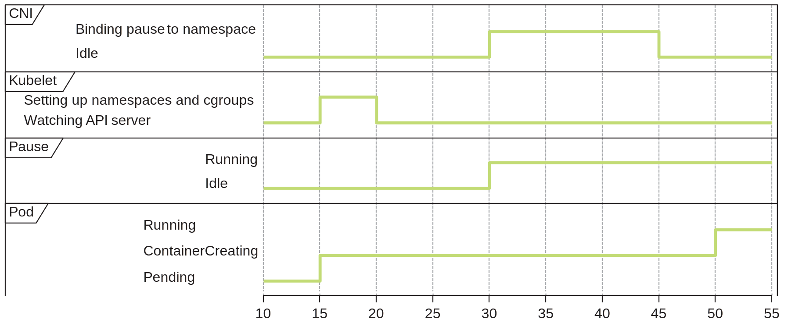
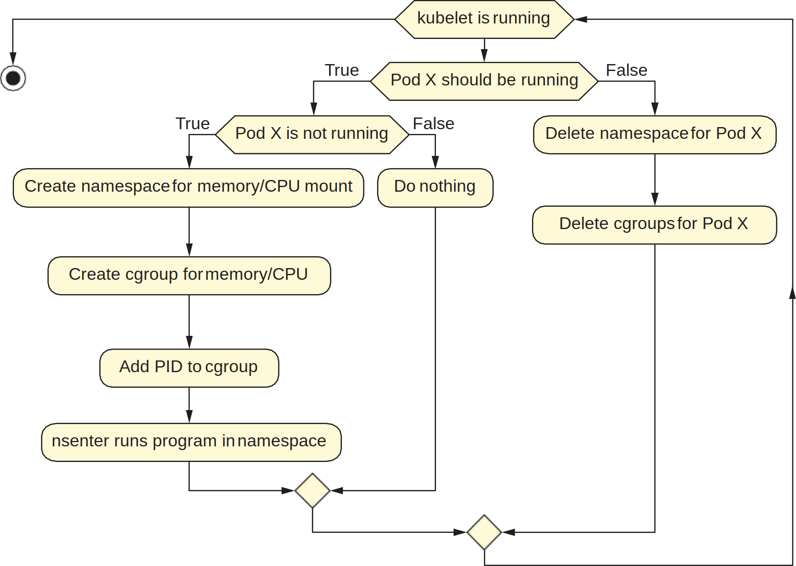
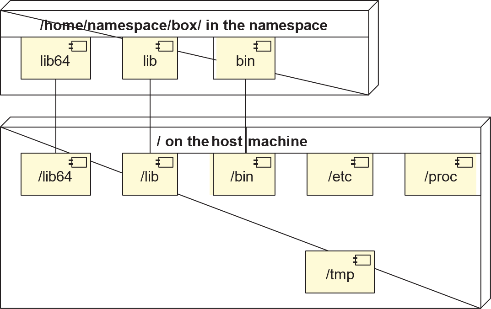
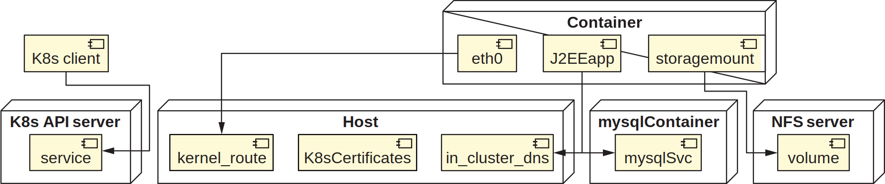

# Ch3. 让我们来创建一个 Pod

这章介绍通过几个已经存在于操作系统中的 Linux 原语（primitives）来构建一个 Pod。



图 3.1 展示了在 Kubernetes 中创建和运行一个 Pod 的一个简化版过程：kubelet 要先发现自己应该去运行一个容器，再通过与容器运行时交流，启动一个叫 _pause_ 的容器，它给 Linux 给容器创建网络的时间。pause 容器是将要运行的应用程序的前身，它存在的目的是创建一个初始 home 来引导（bootstrap）新容器的网络进程与其 PID。

## 什么是 Linux 原语

Linux 原语指构建 Linux 操作系统的基本构件，如 `iptables`, `ls`, `mount` 这些工具都是原语的例子，就像我们经常在 shell 中使用的那些一样。很多 Kubernetes 组件都是基于它们构建的：

- 网络代理 kube-proxy：创建 iptables 规则，这些规则经常被用于 debug 大型集群中的容器网络问题。CNI 也会使用到这个代理
- 容器存储接口 Container Storage Interface (CSI)：定义 kubelet 与存储技术（如 Pure, GlusterFS, vSAN, EBS, NFS）之间通信的 socket。例如，在集群中运行`mount` ，可以显示 Kubernetes 管理的容器和卷挂载，而不需要依赖 kubectl 或其它非原生工具，常用于在 Kubernetes 中排查低层次存储错误
- 容器运行时命令（如 `unshare` 和 `mount`）：创建隔离的进程。创建容器的技术常用到它们。在建模 Kubernetes 集群中的威胁时，运行这些命令的基本能力（通常需要 root 权限）是一个重要的安全边界

### Linux 原语是资源管理工具

以 `ls` 命令为例，它也是个管理工具，可以帮助我们得知：是否可以访问某个文件、任意目录下有哪些文件可用、每个文件的功能（例如，一个文件是否是可执行的）。

"一切皆为文件"是 Linux 独有的。例如，`/proc` 目录包含正在运行的进程的实时信息，在许多方面可以像管理一个文件目录一样管理它。而 Windows 的开发则需要与 Windows APIs、注册表、PowerShell 甚至 GUI 打交道，因此不太可能仅凭读写文件来管理整个 Windows 操作系统。

### 一切皆为文件（或文件描述符）

Linux 原语几乎总是在做一些事情来操纵、移动或提供某种文件的抽象，这是因为用 Kubernetes 构建的一切最初都是为了在 Linux 上工作，而 Linux 从设计上就是使用文件抽象作为控制原语。

"一切皆为文件"的几个例子：

- 标准输出：向标准输出文件写入后，它会魔法般地把内容显示在终端
- 目录：一个包含其他文件名的文件
- 设备：例如以太网设备文件会被附加到容器内部
- 套接字（Socket）和管道（Pipe）：被用于本地进程间通信的文件。CSI 会大量利用这一抽象概念来定义 kubelet 与 Pod 存储实例的通信方式

### 文件是可组合的

这里指管道操作符（`|`），操作符前面的命令的输出会作为其后面命令的输入。下面是一个实用的例子——查看控制平面上的 etcd 容器：

```shell
$ ls /var/log/containers/ | grep etcd
etcd-kind-control-plane_kube-system_etcd-44daab....log
```

> 关于为什么 etcd 可以在容器里运行，生产环境里 etcd 通常运行在一个与其他容器隔离的地方以避免资源竞争，而在小型生产集群或开发环境，etcd 容器挂载的卷存储在本地磁盘上时，即可以保证数据持久化（重启也不会丢失），那么在容器里运行也没问题。

### 安装实验环境

我们在 Linux（Windows 用户最好使用 WSL 2）环境下安装好下述工具，后续的实验会使用到。

- [Docker](https://www.docker.com/get-started/)：我们将把每个 Docker 容器视作 VM，并研究 Linux 的各种属性
- [kubectl](https://kubernetes.io/docs/tasks/tools/)：Kubernetes 命令行工具
- [Kind](https://kind.sigs.k8s.io/)：一个可以轻松建立本地 Kubernetes 集群的工具

完成 Kind 的安装后，我们可以启动一个本地集群：

```shell
$ kind create cluster
Creating cluster "kind" ...
 ✓ Ensuring node image (kindest/node:v1.24.0) 🖼
 ✓ Preparing nodes 📦
 ✓ Writing configuration 📜
 ✓ Starting control-plane 🕹️
 ✓ Installing CNI 🔌
 ✓ Installing StorageClass 💾
Set kubectl context to "kind-kind"
```

上面输出最后一句指的是 kubectl 现已指向我们新建的这个集群，用 kubectl 查看新集群的所有 Pod：

```shell
$ kubectl get pods --all-namespaces
NAMESPACE            NAME                                         READY   STATUS    RESTARTS   AGE
kube-system          coredns-6d4b75cb6d-49wzn                     1/1     Running   0          3m14s
kube-system          coredns-6d4b75cb6d-87vb8                     1/1     Running   0          3m14s
kube-system          etcd-kind-control-plane                      1/1     Running   0          3m28s
kube-system          kindnet-hg8c5                                1/1     Running   0          3m14s
kube-system          kube-apiserver-kind-control-plane            1/1     Running   0          3m28s
kube-system          kube-controller-manager-kind-control-plane   1/1     Running   0          3m29s
kube-system          kube-proxy-dxnv8                             1/1     Running   0          3m14s
kube-system          kube-scheduler-kind-control-plane            1/1     Running   0          3m29s
local-path-storage   local-path-provisioner-9cd9bd544-88lpw       1/1     Running   0          3m14s
```

Kubernetes 节点在哪里？列出容器看看：

```shell
$ docker ps
CONTAINER ID   IMAGE                  COMMAND                   CREATED         STATUS         PORTS                       NAMES
b55055a19d9d   kindest/node:v1.24.0   "/usr/local/bin/entr…"   3 minutes ago   Up 3 minutes   127.0.0.1:35003->6443/tcp   kind-control-plane
```

我们发现了一个名为“Kind 控制平面”的容器，打开另一个终端准备进入该容器操作，只需要执行命令 `docker exec -it <CONTAINER ID> /bin/bash` 或 `docker container exec --interactive --tty kind-control-plane /bin/bash` 就能打开控制平面容器内部的 shell（不要关闭，后面仍会用到）。

## 在 Kubernetes 内使用 Linux 原语

Kubernetes 的核心功能直接或间接地使用到 Linux 原语，一些如“服务网格（service mesh）”、“容器原生存储（container native storage）”等流行词汇，本质上都是由这些操作系统基本功能巧妙组成的集合体。

### 运行一个 Pod 的先决条件

创建 Pod 三要素：隔离、网络和进程管理。这些要求可以借助 Linux 中已有的许多工具来实现：

- swapoff：禁用 swap 的命令，以尊重 CPU 和内存设置的方式运行 Kubernetes 的先决条件
- iptables：网络代理的核心需求，创建 iptables 规则来发送服务流量到 Pod
- mount：路径映射，例如把一个设备作为文件夹映射到 home 目录
- systemd：启动管理所有容器的核心进程 kubelet
- socat：允许进程间建立双向信息流，`kubectl port-forward` 命令的关键组成部分
- nsenter：用于进入进程的各种命名空间的工具，便于查看网络、存储或进程方面在做什么。例如，Kubernetes 集群中的 Pod 的唯一 IP 地址不会被其他 Pod 共享（即使它们在同一个节点上），因为每个 Pod 通常运行在一个单独的命名空间，这时可以用该工具查看这个不能被外部访问的信息
- unshare：允许一个进程创建另一个网络（IP）、挂载（根目录位置）和 PID 隔离的子进程，类似 Linux 原生的 `docker run` 命令
- ps：列出运行中的进程的工具，例如可以用于检测僵尸进程或者衍生出一堆子进程的特权容器等。kubelet 借此监视进程。

### 运行一个简单的 Pod

启动一个运行 BusyBox 容器的 Pod：

```YAML
apiVersion: v1
kind: Pod # 创建一个 Pod 资源，注意这个 kind 和上面的同名工具无关
metadata: # 没有指定 namespace 则默认为 "default"
  name: core-k8s
  labels: # 便于查询和选择器进行过滤的标签
    role: just-an-example
    app: my-example-app
    organization: friends-of-manning
    creator: jay
spec:
  containers:
    - name: any-old-name-will-do
      image: docker.io/busybox:latest # 必须是可以从互联网或本地拉取的镜像地址
      command: ['sleep', '10000']
      ports:
        - name: webapp-port # 在容器上打开 80 端口
          containerPort: 80
          protocol: TCP
```

将上述内容保存至 [pod.yaml](pod.yaml)，创建该 Pod 的命令是 `kubectl create -f pod.yaml`。

我们想知道由 Pod 启动带起进程对操作系统的可见性，这可以**在控制平面容器中**借助 `ps -ax` 命令来列出系统中的所有进程（`-x` flag 允许我们看到系统级进程）进行观察。

```shell
root@kind-control-plane:/# ps -ax | wc -l # 在控制平面容器中计算起初运行了多少个进程
35

$ kubectl create -f pod.yml # 在外部创建一个 Pod
pod/core-k8s created

root@kind-control-plane:/# ps -ax | wc -l # 再回到容器中计算 Pod 创建后有多少运行中的进程
37
```

### 探索 Pod 的 Linux 依赖

运行一个 Pod 和运行别的程序对用户来说没什么区别，同样在输入输出、消耗计算和网络资源，以及依赖共享库和操作系统底层工具等。而 kubelet 做了很多类似 Linux 管理员的工作，比如在程序执行之前为其创建了一个隔离的目录、CPU、内存、网络、namespace 限制和其他资源，在程序退出之后再清理掉这些资源。



图 3.2 展示的是 kubelet/Pod 生命周期，它是最底层的控制循环之一。

这时执行 `kubectl get pods -o yaml` 我们可以看见正在运行的 Pod 对象的全部定义与状态，它在先前提交的 YAML 文件内容之上扩充了更多内容，除了有些是默认值或表示 Pod 的状态，在某些组织内可能会存在一个拦截器，它可以在我们的 YAML 定义被提交至 API 服务器之前对其进行检查与值修改，例如可以在上面附加 CPU 与内存限制。我们可以使用 JSONPath 来筛选出我们感兴趣的内容：

```shell
$ kubectl get pods -o=jsonpath='{.items[0].status.phase}' # Pod 状态
Running
$ kubectl get pods -o=jsonpath='{.items[0].status.podIP}' # Pod IP
10.244.0.7
$ kubectl get pods -o=jsonpath='{.items[0].status.hostIP}' # Pod 所在主机的 IP
172.18.0.2
```

除了状态，我们还可以进一步了解 Pod 上挂载了哪些内容。例如在输出的 YAML 上我们找到 spec 下面的 volumes 字段，里面只有一项内容，表示的是 Kubernetes 集群为 Pod 赋予的一个允许访问 API 服务器的证书。

```YAML
volumes:
- name: kube-api-access-xq7v8
  projected:
	defaultMode: 420
	sources:
	- serviceAccountToken:
		expirationSeconds: 3607
		path: token
	- configMap:
		items:
		- key: ca.crt
		  path: ca.crt
		name: kube-root-ca.crt
	- downwardAPI:
		items:
		- fieldRef:
			apiVersion: v1
			fieldPath: metadata.namespace
		  path: namespace
```

我们可以在控制平面容器内使用 `mount` 命令（或在外部使用 `kubectl exec` 命令）查看 Pod 具体挂载了哪些内容，例如我们可以找到一个 Pods DNS 信息的文件：

```shell
$ kubectl exec -t -i core-k8s mount | grep resolv.conf
/dev/sdd on /etc/resolv.conf type ext4 (rw,relatime,discard,errors=remount-ro,data=ordered)
```

输出显示的 `/dev/sdd` 是我们主机上的卷的所在位置，它有相应的 `resolv.conf` 文件，并且它通常对应于控制平面容器内 `/var/lib/containerd` 中的一个文件夹。例如我们可通过命令 `find /var/lib/containerd/ -name resolv.conf` 在容器内定位该文件。

对于虚拟机，hypervisor（创建虚拟机的东西）不知道虚拟机在运行哪些进程；但对于容器，Docker 创建的进程是由宿主操作系统管理的。这使得 kubelet 可以做很多细粒度的清理和管理任务，以及将关于容器状态信息暴露给 API 服务器。

这实际上强调了容器只不过是一种可以创建出隔离资源的进程，从而令你的程序与集群中其他众多进程和谐相处，这也说明 Pod 和一般的进程没什么区别，只是有一些特点（以我们创建的 Pod 为例）:

- 拥有一个带证书的存储卷，用于访问 API 服务器
- 在第一段为"10"的子网有个专属 IP，与主机的"172"子网 IP 相区分。
- 在其内部命名空间的 PodIP 的开放端口（10.244.0.7:80）上监听流量，同一个集群的其他 Pod 可以访问它
- 我们的 Pod 有一个容器，他有一个唯一的 PID，对我们的主机可见，主机也有能力对其进行管理

## 从零开始创建一个 Pod

> ℹ️ 本章的实验部分从此开始会在**三个**终端之中游走，请注意它们之间的区别：
>
> - `$` : Linux 操作系统的终端，即安装 Kind 集群的地方
> - `root@kind-control-plane:/#` : Kind 集群的控制平面容器内部终端，通过 docker exec 命令可以进入
> - `bash-5.1#` : 我们将要创建的自己的“容器”的终端
> - 行首没有字符则表示输出内容

### 用 chroot 创建一个孤立的进程



我们用 [chroot](https://man7.org/linux/man-pages/man2/chroot.2.html) 为一个进程创建一个与外部隔离的根目录，具体的步骤为：

1. 确定要运行的程序，以及它应该在你的文件系统的什么地方运行
2. 为该程序创造一个运行环境，例如把 `/lib` 目录的内容加载到新的环境中
3. 使用 chroot，在新的根目录下执行该程序

此时该程序将处于完美的隔离状态，无法读写你的文件系统中的其它内容。这听起来比较像 Docker 在做的事，下面我们就编写一个类似 dockerfile 的脚本，**命名为 `chroot0.sh`，强烈建议使用该文件名**，后面修改 cgroup 的时候会涉及到。

```shell
# /bin/bash

# Makes our box with the bin and lib directories as dependencies for our Bash program
mkdir -p /home/namespace/box/bin
mkdir -p /home/namespace/box/lib
mkdir -p /home/namespace/box/lib64
mkdir -p /home/namespace/box/proc
mkdir -p /home/namespace/box/data

# Copies all the programs from our base OS into this box so we can run Bash in our root directory
cp -v /bin/bash /home/namespace/box/bin
cp -v /bin/ip /home/namespace/box/bin
cp -v /bin/ls /home/namespace/box/bin
cp -v /bin/mount /home/namespace/box/bin
cp -v /bin/umount /home/namespace/box/bin
cp -v /bin/kill /home/namespace/box/bin
cp -v /bin/ps /home/namespace/box/bin
cp -v /bin/curl /home/namespace/box/bin
cp -v /bin/pidof /home/namespace/box/bin
cp -v /bin/expr /home/namespace/box/bin
cp -v /bin/rm /home/namespace/box/bin

# Copies the library dependencies of these programs into the lib/ directories
cp -r /lib/* /home/namespace/box/lib/
cp -r /lib64/* /home/namespace/box/lib64/

# Mounts the /proc and /tmp directory to this location
mount -t proc proc /home/namespace/box/proc
mount --bind -v /tmp/ /home/namespace/box/data

# This is the important part: we start our isolated Bash process in a sandboxed directory.
chroot /home/namespace/box /bin/bash
```

在上面的脚本中，我们在 `/home/namespace/box` 创建了一个隔离的环境，把共享库和包括 bash 和 ls 这样的必需程序带到了里面，并且挂载了外部的 `/proc` 目录来允许使用 ps 来探索 chroot 启动的进程的安全边界，最后用 chroot 启动 bash。

**我们要在控制平面节点上执行上述脚本**。我们通过 `docker exec` 进入控制平面容器，创建（或是在外部编辑好后复制进来，例如 `docker cp chroot0.sh kind-control-plane:/`，BusyBox 里没有文本编辑器）上述脚本并执行，效果如下：

```shell
root@kind-control-plane:/# chmod 777 chroot0.sh
root@kind-control-plane:/# ./chroot0.sh
'/bin/bash' -> '/home/namespace/box/bin/bash'
...
'/bin/rm' -> '/home/namespace/box/bin/rm'

bash-5.1# ls
bin  data  lib  lib64  proc

bash-5.1# ps
    PID TTY          TIME CMD
   2708 ?        00:00:00 sh
   3514 ?        00:00:00 sh
   3532 ?        00:00:00 bash
   3548 ?        00:00:00 ps
```

终端的前缀变成了 `bash-5.1#` 就说明我们成功进入我们启动的“容器”。`ls` 命令也确实只输出了我们带入隔离环境内的文件。

**执行 `exit` 命令即可退出回到控制平面容器。清理环境可以使用下述命令**：

```shell
root@kind-control-plane:/# umount /home/namespace/box/data && umount /home/namespace/box/proc && rm -rf /home/namespace
```

### 使用 mount 为进程提供数据

我们可以使用 `mount` 命令向为隔离环境挂载来自外面的数据。

例如，我们的目标是挂载外部的 `/tmp` 目录中的文件到容器内的 `/data` 目录下。首先创建一个文件在外部的 `/tmp` 目录中（如 `touch /tmp/abc`），然后重新执行脚本 `./chroot0.sh`，我们就可以用 `ls` 命令在“容器”的 `/data` 文件夹下发现我们创建的文件 `abc`。

注意，这事实上打开了一个安全漏洞。在我们将 `/tmp` 的内容挂载到容器上之后，任何人都可以操作或读取其内容。这就是为什么 Kubernetes volumes 的 `hostPath` 功能经常在生产集群中被禁用。

### 用 unshare 保护我们的进程

由于我们先前挂载了外部的 `/proc` 目录到我们的“容器”上，所以 `ps -ax` 的输出会显示外部的进程。更可怕的是，你甚至可以使用我们带进来的 `kill` 命令去杀掉这些可见进程之中的任意一个，你可以通过以下小实验尝试：

1. 通过 `docker exec` 进入控制平面容器，并执行命令 `ps -ax | grep kubelet` 找到 kubelet 进程的 PID
2. 重新执行脚本 `./chroot0.sh` 进入我们的”容器“
3. 执行命令 `kill <kubelet-PID>` 来试图杀掉我们找到的 kubelet 进程

结果它成功地杀掉了这个 kubelet 进程。因为你可以执行 exit 回到控制平面，再执行 `ps -eo pid,lstart,cmd | grep kubelet` 就能发现，kubelet 进程虽然还在，但其 PID 和我们刚才查询并使用到的不一样了，而且其启动时间也刷新了。

为了避免这种“CVE”，进一步朝着隔离的目标迈进，我们可以使用 [`unshare`](https://man7.org/linux/man-pages/man1/unshare.1.html) 命令，也就是说这一次我们无法再从隔离环境内杀死包括 kubelet 进程在内的任一外部进程。

我们**对上述脚本的最后一行使用 unshare 进行修改，将其替换成**：

```shell
unshare --pid --net --fork --mount-proc=/home/namespace/box/proc chroot /home/namespace/box /bin/bash
```

将更新后的脚本复制到控制平面容器里，使用上述清除命令清理旧的环境，再执行更新后的脚本 `./chroot0.sh` 来到我们的”容器“，并执行 `ps -ax` 和 `kill <kubelet-PID>` 看看有什么不一样。

```shell
bash-5.1# ps -ax
    PID TTY      STAT   TIME COMMAND
      1 ?        S      0:00 /bin/bash
      2 ?        R+     0:00 ps -ax

bash-5.1# kill 4751 # 外部 kubelet 的 PID
bash: kill: (4751) - No such process
```

我们可以发现：

1. 入口程序 `bash` 的 PID 不像我们上次执行 ps 显示的是一个大数，而且从 1 开始，相当于是隔离环境中第一个运行的进程
2. 即使挂载了 `/proc` 目录并执行 `ps -ax` 也不再显示外部进程信息
3. 尝试杀死外部 kubelet 进程不再成功，因为无法用该 PID 找到它

### 隔离的网络命名空间

因为我们上面的 `unshare` 命令添加了 flag `--net`，所以我们的隔离“容器”处于一个新的网络环境。

```shell
bash-5.1# ip a
1: lo: <LOOPBACK> mtu 65536 qdisc noop state DOWN group default qlen 1000
    link/loopback 00:00:00:00:00:00 brd 00:00:00:00:00:00
2: sit0@NONE: <NOARP> mtu 1480 qdisc noop state DOWN group default qlen 1000
    link/sit 0.0.0.0 brd 0.0.0.0
```

而我们回到最初的终端（运行 kind 的 Linux 终端），查看任意一个 Pod 的网络设备，我们可以发现一个显著的区别，我们的“容器”与真正的 Pod 相比少了一个 eth0 设备。这说明 chroot 虽然帮我们实现了简易版容器化，但我们仍缺少这个重要的网络设备。我们同样可以在控制平面容器找到一个 eth0 设备。

```shell
$ kubectl exec -t -i core-k8s ip a # 查看 core-k8s 这个 Pod 的网络设备
1: lo: <LOOPBACK,UP,LOWER_UP> mtu 65536 qdisc noqueue qlen 1000
    link/loopback 00:00:00:00:00:00 brd 00:00:00:00:00:00
    inet 127.0.0.1/8 scope host lo
       valid_lft forever preferred_lft forever
    inet6 ::1/128 scope host
       valid_lft forever preferred_lft forever
2: sit0@NONE: <NOARP> mtu 1480 qdisc noop qlen 1000
    link/sit 0.0.0.0 brd 0.0.0.0
3: eth0@eth0: <BROADCAST,MULTICAST,UP,LOWER_UP> mtu 1500 qdisc noqueue
    link/ether 86:d4:53:ed:1c:e8 brd ff:ff:ff:ff:ff:ff
    inet 10.244.0.2/24 brd 10.244.0.255 scope global eth0
       valid_lft forever preferred_lft forever
    inet6 fe80::84d4:53ff:feed:1ce8/64 scope link
       valid_lft forever preferred_lft forever
```

我们的“容器”不但没有 eth0 这个设备，而且失去了路由和 IP 信息（这些信息是从 `hostNetwork` namespace 继承的）。为了验证这一点，由于我们先前也拷贝了 cURL 工具，所以可以试着先获取 google.com 的一个 IP 地址，然后在“容器”内部和外部分别对该 IP 使用 `curl` 命令看看有什么区别：

```shell
bash-5.1# curl 142.250.189.206 # 用 ping 得到的 google.com 的一个 IP 地址，我们在容器内部 curl 它。
curl: (7) Couldn't connect to server

bash-5.1# exit # 来到容器外部
exit

root@kind-control-plane:/# curl 142.250.189.206 # 我们在控制平面 curl 它。
<HTML><HEAD><meta http-equiv="content-type" content="text/html;charset=utf-8">
<TITLE>301 Moved</TITLE></HEAD><BODY>
<H1>301 Moved</H1>
The document has moved
<A HREF="http://www.google.com/">here</A>.
</BODY></HTML>
```

### 使用 cgroup 调整 CPU

[cgroups](https://www.cnblogs.com/sparkdev/p/8296063.html) 是控制组的简称，允许给运行在集群中的应用程序提供更多或更少的 CPU 和内存。在 Kubernetes 上资源的 YAML 定义的 resources 字段可以进行设置。例如下面的这个 greedy-pod.yaml 文件：

```YAML
apiVersion: v1
kind: Pod
metadata:
  name: core-k8s-greedy
spec:
  containers:
    - name: any-old-name-will-do
      image: docker.io/busybox:latest
      command: ['sleep', '10000']
      resources:
        limits:
          memory: "200Mi"
        requests:
          memory: "100Mi"
```

实际在 Kubernetes Linux 集群中管理 cgroup 限制的是 [cgroup 驱动（cgroup driver）](https://kubernetes.io/zh-cn/docs/tasks/administer-cluster/kubeadm/configure-cgroup-driver/)，默认的驱动是 systemd；而 Windows 集群对于 resources 字段的处理则是一套完全不一样的实现方式。

我们下面尝试手动控制 cgroup 限制，：

1. 创建一个 `chroot` 启动的进程并得到它的 PID（就是我们脚本最后一行执行的进程）
2. 将对于该 PID 的限制写入操作系统

开始之前，把我们的 `chroot0.sh` 的最后一行改为：

```shell
unshare --mount --pid --net --fork chroot /home/namespace/box /bin/bash
```

即暂时不要挂载 `/proc` 目录以让我们能够获得真实的 PID。清理旧环境后重新执行更新后的 `./chroot0.sh` 来到我们的”容器“，并执行 `expr $(pidof unshare) + 1` 来获得我们 `chroot` 启动进程的真实 PID（下面的例子显示我们的 chroot 进程 PID 是 9711），之后再重新挂载上 `/proc` 目录。

```shell
bash-5.1# expr $(pidof unshare) + 1
9711

bash-5.1# mount --type proc none /proc
```

现在我们可以开始操作 cgroup 限制了。重新打开一个终端，并使用 `docker exec` 命令进入控制平面容器，然后执行下面的命令：

```shell
root@kind-control-plane:/# # 创建一个 cgroup
root@kind-control-plane:/# mkdir -p /sys/fs/cgroup/memory/chroot0
root@kind-control-plane:/# # 只给我们的容器分配了10个字节的内存，使其无法工作
root@kind-control-plane:/# echo "10" > /sys/fs/cgroup/memory/chroot0/memory.limit_in_bytes
root@kind-control-plane:/# # 禁用容器的 swap，就像 Kubernetes 集群都会做的那样
root@kind-control-plane:/# echo "0" > /sys/fs/cgroup/memory/chroot0/memory.swappiness
root@kind-control-plane:/# # 告诉操作系统，这个 cgroup 的进程（unshare chroot 启动的 Bash）的 PID ，在此处是 9711
root@kind-control-plane:/# echo 9711 > /sys/fs/cgroup/memory/chroot0/tasks
```

创建 `/chroot0` 目录触发了操作系统的一个动作，即建立一个包含内存、CPU 等的完整 cgroup，这可以通过 `ls` 查看我们刚才创建的 cgroup （目录）验证：

```shell
$ ls /sys/fs/cgroup/memory/chroot0/
cgroup.clone_children           memory.kmem.tcp.max_usage_in_bytes  memory.oom_control
cgroup.event_control            memory.kmem.tcp.usage_in_bytes      memory.pressure_level
cgroup.procs                    memory.kmem.usage_in_bytes          memory.soft_limit_in_bytes
memory.failcnt                  memory.limit_in_bytes               memory.stat
memory.force_empty              memory.max_usage_in_bytes           memory.swappiness
memory.kmem.failcnt             memory.memsw.failcnt                memory.usage_in_bytes
memory.kmem.limit_in_bytes      memory.memsw.limit_in_bytes         memory.use_hierarchy
memory.kmem.max_usage_in_bytes  memory.memsw.max_usage_in_bytes     notify_on_release
memory.kmem.tcp.failcnt         memory.memsw.usage_in_bytes         tasks
memory.kmem.tcp.limit_in_bytes  memory.move_charge_at_immigrate
```

真正验证是否生效的环节来了。切回我们启动的“容器”的终端，执行 `ls` 命令看看效果：

```shell
bash-5.1# ls
Killed
root@kind-control-plane:/#
```

不出意外，我们的“容器”嗷的一声挂了，因为我们只为他分配了 10 个字节的内存大小，甚至连执行 `ls` 命令都会 OOM。

**让我们回顾一下**：我们已经创建了自己的“容器”，它与主机上其他文件隔离但也可以通过挂载向其提供数据（文件），资源占用有限制，并且运行在一个隔离的进程空间使其认为自己是整个世界上唯一的进程。这是 Kubernetes 集群中 Pod 的自然状态。

## 在现实世界中使用我们的 Pod

### 联网问题



图 3.4 描述的是一个真实的容器与 Kubernetes 集群的交互。我们在上一节手工制作的“容器”与之相比没有网卡，也没有一个集群中独立的 IP，因此面对微服务常常需要与其他服务进行沟通的场景，我们自制的“容器”是无法做到的，更不用说借助 DNS 进行服务发现、注入证书之类的能力了。

Pod 联网问题可以细化为三个场景：

- 入流量：接收来自集群内其它 Pod 的流量
- 出流量：向其它 Pod 或互联网发送的流量
- 负载均衡：凭静态 IP 作为一个端点，来接收由 Service 负载均衡传递过来的流量

为了实现这些操作，API 服务器会将 Pod 的元数据（metadata）发布到 Kubernetes 的其他部分；kubelet 会对其状态进行监视，并随着时间的推移更新这些状态。因此，Pod 不仅仅是一个容器命令和一个 Docker 镜像，它不但有元数据（例如 labels），而且它还应该有规范（spec）。规范是指 Pod 有明确定义的状态、重启逻辑，以及在集群内拥有的 IP 地址的可达性的保证。

### 利用 iptables 来了解 kube-proxy 如何实现 Kubernetes 服务

[iptables](https://linux.die.net/man/8/iptables) 是 Linux 上常用的防火墙软件。下面是一个在 Kubernetes 之外的传统环境中配置 iptables 的例子：

```shell
$ iptables -A INPUT -s 10.1.2.3 -j DROP
$ iptables-save | grep 10.1.2.3
-A INPUT -s 10.1.2.3/32 -j DROP
```

第一条命令添加了（`-A`）一条规则：要丢弃（`-j DROP`）来自（`-s`）10.1.2.3 的任何流量。第二条命令在查询这条新添加的规则。

在大多数 Kubernetes 集群中，这些网络规则完全由 kube-proxy 实现，它使用 iptables 程序来做低级别的网络路由。

请注意，基本的 Pod 网络不需要 iptables，那是由 CNI 处理的。然而，现实世界中几乎所有的 Kubernetes 集群都是通过 Service 对象消费的。

一个 Pod 需要的远不止是几个防火墙规则。它至少需要：

- 作为一个端点，接收流量的能力（例如接收由 Service 负载均衡传递过来的流量）
- 向外界发送流量的能力
- 跟踪（并记录）正在进行的 TCP 连接的状态的能力（在 Linux 中用的是 [conntrack](https://arthurchiao.art/blog/conntrack-design-and-implementation-zh) 模块，它是 Linux 内核的一部分)

### 从 kube-dns 了解 Pod 流量转发

在 kind 集群里你可以通过列出 kube-system 这个 namespace 下的 Services 对象来找到 kube-dns 这个服务，并进一步通过 `k8s-app=kube-dns` 这个 label 列出挂载在它后面的所有 Pods：

```shell
$ kubectl get service kube-dns -n kube-system -o wide
NAME       TYPE        CLUSTER-IP   EXTERNAL-IP   PORT(S)                  AGE   SELECTOR
kube-dns   ClusterIP   10.96.0.10   <none>        53/UDP,53/TCP,9153/TCP   22m   k8s-app=kube-dns
$ kubectl get pod -l k8s-app=kube-dns -A
NAMESPACE     NAME                       READY   STATUS    RESTARTS   AGE
kube-system   coredns-6d4b75cb6d-ff52n   1/1     Running   0          22m
kube-system   coredns-6d4b75cb6d-zn55v   1/1     Running   0          22m
```

从名字和端口号 53 我们可以得知这是一个 DNS 服务。当集群内的 Pod 之间需要在通信前向该服务查询 DNS 时，kube-dns 会把流量转发到两个 coredns Pod 的其中一个。

下面我们来验证一下，我们先查询出两个 coredns Pod 的集群内 IP 地址：

```shell
$ kubectl get pod coredns-6d4b75cb6d-zn55v -n kube-system -o=jsonpath='{.status.podIP}'
10.244.0.3
$ kubectl get pod coredns-6d4b75cb6d-ff52n -n kube-system -o=jsonpath='{.status.podIP}'
10.244.0.4
```

现在我们再次进入控制平面容器，使用 `ip route` 命令查看控制平面节点的路由信息：

```shell
root@kind-control-plane:/# ip route
default via 172.18.0.1 dev eth0
10.244.0.2 dev vethf6e1facb scope host
10.244.0.3 dev veth365aab0b scope host
10.244.0.4 dev vethb5e9a03d scope host
172.18.0.0/16 dev eth0 proto kernel scope link src 172.18.0.2
```

我们发现在输出的路由表里也存在 10.244.0.3 和 10.244.0.4 这两个 IP，Pod 的 IP 地址和路由规则都是由 CNI 插件提供的。路由表的描述是：当目的地址是 10.244.0.3 或 10.244.0.4 时，将流量转发至特定的 veth 设备。这些设备也是由 CNI 插件制作的，我们可以用 `ip a` 命令查看控制平面节点的网络设备：

```shell
root@kind-control-plane:/# ip a
...
3: vethf6e1facb@if3: <BROADCAST,MULTICAST,UP,LOWER_UP> mtu 1500 qdisc noqueue state UP group default
    link/ether 46:68:a9:a7:b6:c2 brd ff:ff:ff:ff:ff:ff link-netns cni-ac9a3988-a855-101b-de1b-4c48546e32ae
    inet 10.244.0.1/32 scope global vethf6e1facb
       valid_lft forever preferred_lft forever
4: veth365aab0b@if3: <BROADCAST,MULTICAST,UP,LOWER_UP> mtu 1500 qdisc noqueue state UP group default
    link/ether 2a:50:35:d0:13:60 brd ff:ff:ff:ff:ff:ff link-netns cni-955eeeb6-ecaf-db34-deb7-a65264ade2f8
    inet 10.244.0.1/32 scope global veth365aab0b
       valid_lft forever preferred_lft forever
5: vethb5e9a03d@if3: <BROADCAST,MULTICAST,UP,LOWER_UP> mtu 1500 qdisc noqueue state UP group default
    link/ether ba:17:4e:74:7b:e9 brd ff:ff:ff:ff:ff:ff link-netns cni-66de6450-7376-4ebd-d4e8-8b7f0cc2e994
    inet 10.244.0.1/32 scope global vethb5e9a03d
       valid_lft forever preferred_lft forever
...
```

那么 DNS Services 是如何将流量路由到这些 veth 设备上的呢？运行 `iptables-save` 命令可以列出所有 iptables 规则，由于规则众多，我们可以用 `grep` 命令筛选出我们感兴趣的规则。

首先从服务 kube-dns 的 ClusterIP 10.96.0.10 开始：

```shell
root@kind-control-plane:/# iptables-save | grep 10.96.0.10
...
-A KUBE-SERVICES -d 10.96.0.10/32 -p tcp -m comment --comment "kube-system/kube-dns:dns-tcp cluster IP" -m tcp --dport 53 -j KUBE-SVC-ERIFXISQEP7F7OF4
...
```

我们找到一条与”通过 TCP 查询 DNS“有关的规则，它的处理方式是传递给规则 KUBE-SVC-ERIFXISQEP7F7OF4，那我们继续找出这条规则：

```shell
root@kind-control-plane:/# iptables-save | grep KUBE-SVC-ERIFXISQEP7F7OF4
...
-A KUBE-SVC-ERIFXISQEP7F7OF4 -m comment --comment "kube-system/kube-dns:dns-tcp -> 10.244.0.3:53" -m statistic --mode random --probability 0.50000000000 -j KUBE-SEP-ZXMNUKOKXUTL2MK2
-A KUBE-SVC-ERIFXISQEP7F7OF4 -m comment --comment "kube-system/kube-dns:dns-tcp -> 10.244.0.4:53" -j KUBE-SEP-SF3LG62VAE5ALYDV
...
```

从字面意思上我们可以理解，名为 KUBE-SVC-ERIFXISQEP7F7OF4 的第一条规则接管的概率是 50%，它会把流量转发给规则 KUBE-SEP-ZXMNUKOKXUTL2MK2，否则在另外 50%的概率被下一条同名规则接管，它会把流量转发给规则 KUBE-SEP-SF3LG62VAE5ALYDV。我们继续看规则 KUBE-SEP-ZXMNUKOKXUTL2MK2：

```shell
root@kind-control-plane:/# iptables-save | grep KUBE-SEP-ZXMNUKOKXUTL2MK2
...
-A KUBE-SEP-ZXMNUKOKXUTL2MK2 -p tcp -m comment --comment "kube-system/kube-dns:dns-tcp" -m tcp -j DNAT --to-destination 10.244.0.3:53
...
```

这回实锤了流量被最终打到其中一个 codedns Pod 的 IP 上，具体地，规则 DNAT 是预定义的，表示目标地址转换，需要指定转换后目标地址，在这里就是 10.244.0.3:53。如果我们找到在 KUBE-SEP-SF3LG62VAE5ALYDV 规则上的类似的操作。

### 其它问题

除了网络问题外，我们也提及过其他问题，包括存储、调度和重启（升级）等。

- 存储：诚然我们有存储挂载和卸载的工具，但存储有很多的类型，对于不同的存储类型我们还有“检测它们的挂载与卸载操作是否失败”的需求。这些在 Kubernetes 由 StorageClasses、PersistentVolumes 和 PersistentVolumeClaims 管理
- 调度：我们先前讨论过 Pod 的调度本身是复杂的，例如如果我们在设置 cgroup 的时候把内存设定过高，或者我们在没有足够的内存的节点上以 request 字段上定义的内存大小来启动一个 Pod，那么最终可能会令节点崩溃。我们也简介过 Kubernetes 的 Pod 调度策略，它会根据亲和力（affinity）、CPU、内存、存储可用性、数据中心拓扑 结构等参数，为 Pod 挑选简单、以容器为中心、可预测的节点
- 升级与重启：Pod 的 PID 会在重启后变化，回想我们在做 cgroup 实验的时候，我们每次清理与启动脚本，都需要特地记录我们 bash 程序的新 PID，这样我们才可以凭此 PID 修改该进程的 cgroup 参数。而当类似的需求成规模后，仅凭 shell 脚本是没办法处理的。Kubernetes 中的 Deployments、StatefulSets、Jobs 和 DaemonSets 会以一种优雅（graceful）的方式处理升级

## 扩展阅读

- [Kind/Dockerfile](https://github.com/kubernetes-sigs/kind/blob/main/images/base/Dockerfile)
- [深入理解 Kubernetes 网络原理之二——service 原理](https://zhuanlan.zhihu.com/p/404837363)
