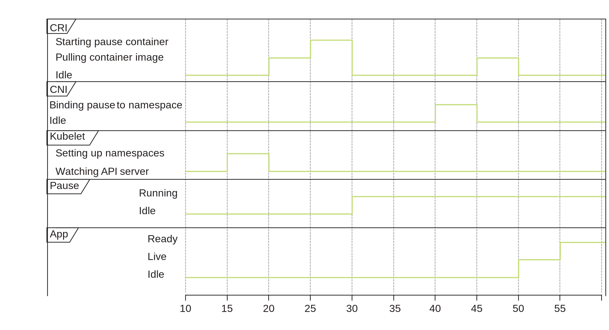
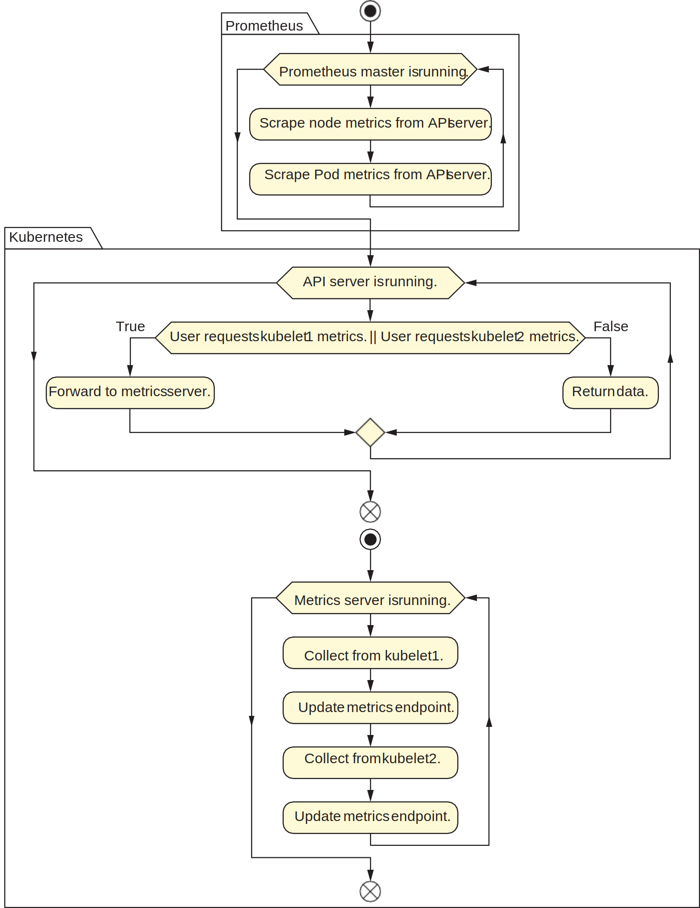
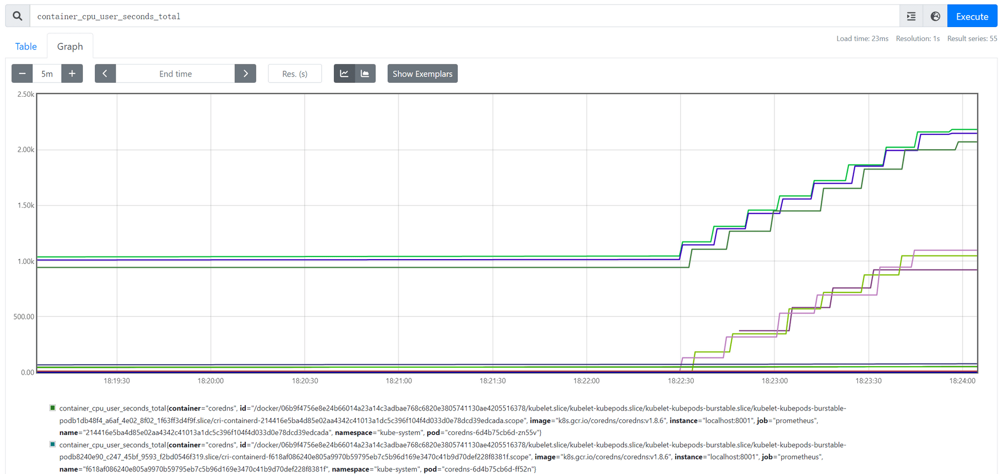
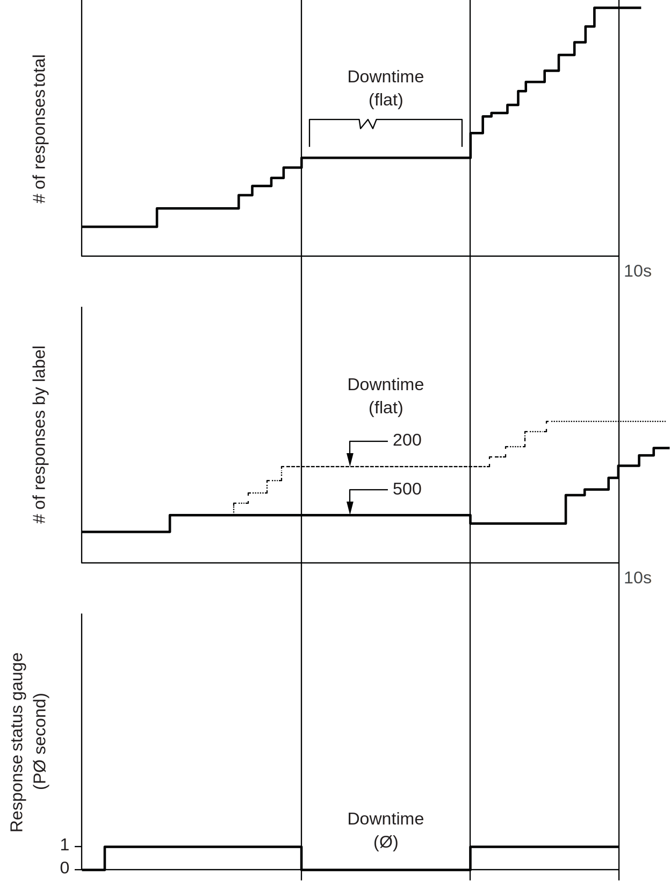

# Ch4. 为我们 Pod 中的进程使用 cgroups



我们进一步细化一个 Pod 的创建过程。kubelet 先调用 CRI 把 Pause 镜像拉取下来并启动 Pause 容器，接着使用 CNI 给容器分配 IP，再然后运行一个或多个 Pause 容器。Pause 容器起到占位符的作用，kubelet 在其中创建 namespace 和 cgroup，以便容器在它们的控制下运行。直至 Pause 容器被添加到 namespace，应用程序才开始从空闲状态启动。

为了让应用程序最终准备好让 Kubernetes 对其进行负载均衡，这些临时进程需要以高度协调的方式分享有限的资源并运行，这就说明协调资源是一个复杂、需要守序的过程。

> 用一个例子描述在有限资源下协调各种不同特性的程序的情景。首先，我们有三个程序：
>
> - 计算 π：CPU 密集型
> - 用哈希表缓存维基百科：内存密集型
> - 备份 1TB 数据库：占用很少的 CPU 和内存，但需要很大的磁盘
>
> 如果这里有一台 2 核、101GB 内存和 1.1TB 磁盘的计算机，理论上我们可以把这三个程序一并放在这些资源上运行，但考虑下列可能会发生的错误：
>
> - 假如“计算 π”程序有 bug，它把中间结果写磁盘上但没有回收，那么“备份 1TB 数据库”程序将无足够磁盘空间可用
> - 假如“维基百科缓存”程序有 bug，计算哈希值的散列函数过于 CPU 密集，那“计算 π”程序的效率会受损失
> - 假如“数据库备份”程序有 bug，它在备份过程中写了太多日志而占用了比预计要多的 CPU 和内存，那么另外两个程序会受到影响
>
> 可想而知，理想的解决方案是：
>
> - 用 1 个内核和 1KB 内存运行“计算 π”进程
> - 用 0.5 个核和 99GB 内存运行“维基百科缓存”进程
> - 用 0.5 个核、1GB 内存和专门的持久化存储运行“数据库备份”进程

为了使所有程序都能以可预测的方式进行，cgroups 允许为内存、CPU 和其他操作系统资源定义层次分明的资源池。一个程序创建的所有线程都使用最初授予父进程的同一资源池，父进程之间不可互相抢占对方的资源。谨慎为 Pod 设置 cgroup 是作为微服务运行应用程序的核心。

## Linux 中的进程和线程

Linux 中的每个进程可以创建一个或多个线程，它们共享该进程的资源（如地址空间等）。下面是一个查看进程 kube-scheduler 所拥有的线程的例子：

```shell
root@kind-control-plane:/# ps -C kube-scheduler # 拿到进程 kube-scheduler 的 PID
    PID TTY          TIME CMD
    688 ?        00:00:04 kube-scheduler
root@kind-control-plane:/# ps -T 688 # 用 PID 查询其线程
    PID    SPID TTY      STAT   TIME COMMAND
    688     688 ?        Ssl    0:00 kube-scheduler --authentication-kubeconfig=/etc/kubernetes/scheduler.conf...
    688     741 ?        Ssl    0:00 kube-scheduler --authentication-kubeconfig=/etc/kubernetes/scheduler.conf...
    688     742 ?        Ssl    0:00 kube-scheduler --authentication-kubeconfig=/etc/kubernetes/scheduler.conf...
	...
```

我们用 pstree 命令进一步探究（使用 `apt-get install psmisc` 安装）：

```shell
root@kind-control-plane:~# pstree -t -c | grep kube-scheduler
        |-containerd-shim-+-kube-scheduler-+-{kube-scheduler}
        |                 |                |-{kube-scheduler}
        |                 |                |-{kube-scheduler}
	...
```

发现 kube-scheduler 的父级是 `containerd-shim`，所以这个调度器是作为一个容器运行的，容器运行时是 containerd。我们集群中的 Pod 都是 containerd 容器运行时管理的，因为 Docker 容器运行时已经被新版 Kubernetes 废弃了。

### systemd 与启动进程

命令 `systemctl status` 或者 `systemd-cgls` 可以列出 cgroup 树。我们先看看 kind 集群控制平面节点的 cgroup 树：

```shell
root@kind-control-plane:/# systemctl status
● kind-control-plane
    State: running
     Jobs: 0 queued
   Failed: 0 units
    Since: Fri 2022-09-02 16:15:53 UTC; 1h 1min ago
   CGroup: /docker/06b9f4756e8e24b66014a23a14c3adbae768c6820e3805741130ae4205516378
           ├─init.scope
           │ └─1 /sbin/init
           ├─system.slice
           │ ├─containerd.service …
           │ │ ├─ 222 /usr/local/bin/containerd
           │ │ ├─ 463 /usr/local/bin/containerd-shim-runc-v2
	...
```

退出节点容器回到 Linux 系统终端，则该命令输出（WSL 2 请尝试 `systemd-cgls` 命令）：

```shell
$ systemd-cgls
Control group /:
-.slice
├─docker
│ └─06b9f4756e8e24b66014a23a14c3adbae768c6820e3805741130ae4205516378
│   ├─init.scope
│   ├─system.slice
│   │ ├─containerd.service
│   │ └─systemd-journald.service
│   └─kubelet.slice
│     ├─kubelet.service
│     └─...
...
```

我们发现：

- 一般 Linux 机器的 cgroup 树的根是 `/`，而控制平面容器的根是 `/docker/06b9f4...`
- 在运行控制平面容器的 Linux 主机上的 cgroup 树中可以找出 `/docker/06b9f4...`

因为我们所谓的节点实质是 Kind 利用容器实现的，所以对于真正的 Kubernetes 集群的节点上的 cgroup 树，其根很有可能不会是一个 Docker，也许也是 `/`，也可能是一个 containerd。

我们可以尝试杀掉进程 kube-scheduler，然后会发现该进程及其线程立刻重启了（换上了新的 PID)。这是由 kubelet 本身完成的，它有一个 `/manifests` 目录，它包含 kubelet 一些应该保持运行的进程（甚至在 API 服务器能够调度容器之前）。事实上，这就是 Kubernetes 通过 kubelet 安装自己的方式。使用 kubeadm（现在最常见的安装工具）安装 Kubernetes 的生命周期看起来是这样的：

- kubelet 有一个 `/manifests` 目录，包含 API 服务器、调度器和控制器管理器
- kubelet 由 `systemd` 启动
- kubelet 告诉 containerd（或其它容器运行时）去启动 `/manifests` 目录下的所有进程
- 一旦 API 服务器启动，kubelet 就会连接到它并听候 API 服务器的命令（如启动容器）

进一步探索这个 `/manifests` 目录：

```shell
root@kind-control-plane:/# ls /etc/kubernetes/manifests/
etcd.yaml  kube-apiserver.yaml  kube-controller-manager.yaml  kube-scheduler.yaml
```

该目录会被持续扫描，当有新的 Pod 放入其中时，kubelet 会将其创建并运行。因为这些 Pod 不是通过 Kubernetes API 服务器编排的，所以它们需要让 API 服务器意识到它们的存在。这些在 Kubernetes 控制平面知识之外创建的 Pod 被称为 Mirror Pod，它们也可以通过 `kubectl get pods -A` 列出，但它们由 kubelet 独自创建和管理的，这允许 kubelet 启动整个 Kubernetes 集群。

现在让我们来探索 kube-scheduler 这个 Pod 的 cgroup。

```shell
root@kind-control-plane:/# cat /proc/2990/cgroup # 2990 是 kube-scheduler 的 PID
14:name=systemd:/docker/06b9f.../kubelet.slice/kubelet-kubepods.slice/kubelet-kubepods-burstable.slice/kubelet-kubepods-burstable-podc534a....slice/cri-containerd-225c6....scope
13:rdma:/kubelet.slice/kubelet-kubepods.slice/kubelet-kubepods-burstable.slice/kubelet-kubepods-burstable-podc534a....slice/cri-containerd-225c6....scope
12:pids:/docker/06b9f.../kubelet.slice/kubelet-kubepods.slice/kubelet-kubepods-burstable.slice/kubelet-kubepods-burstable-podc534a....slice/cri-containerd-225c6....scope
11:hugetlb:/docker/06b9f.../kubelet.slice/kubelet-kubepods.slice/kubelet-kubepods-burstable.slice/kubelet-kubepods-burstable-podc534a....slice/cri-containerd-225c6....scope
10:net_prio:/docker/06b9f.../kubelet.slice/kubelet-kubepods.slice/kubelet-kubepods-burstable.slice/kubelet-kubepods-burstable-podc534a....slice/cri-containerd-225c6....scope
9:perf_event:/docker/06b9f.../kubelet.slice/kubelet-kubepods.slice/kubelet-kubepods-burstable.slice/kubelet-kubepods-burstable-podc534a....slice/cri-containerd-225c6....scope
8:net_cls:/docker/06b9f.../kubelet.slice/kubelet-kubepods.slice/kubelet-kubepods-burstable.slice/kubelet-kubepods-burstable-podc534a....slice/cri-containerd-225c6....scope
7:freezer:/docker/06b9f.../kubelet.slice/kubelet-kubepods.slice/kubelet-kubepods-burstable.slice/kubelet-kubepods-burstable-podc534a....slice/cri-containerd-225c6....scope
6:devices:/docker/06b9f.../kubelet.slice/kubelet-kubepods.slice/kubelet-kubepods-burstable.slice/kubelet-kubepods-burstable-podc534a....slice/cri-containerd-225c6....scope
5:memory:/docker/06b9f.../kubelet.slice/kubelet-kubepods.slice/kubelet-kubepods-burstable.slice/kubelet-kubepods-burstable-podc534a....slice/cri-containerd-225c6....scope
4:blkio:/docker/06b9f.../kubelet.slice/kubelet-kubepods.slice/kubelet-kubepods-burstable.slice/kubelet-kubepods-burstable-podc534a....slice/cri-containerd-225c6....scope
3:cpuacct:/docker/06b9f.../kubelet.slice/kubelet-kubepods.slice/kubelet-kubepods-burstable.slice/kubelet-kubepods-burstable-podc534a....slice/cri-containerd-225c6....scope
2:cpu:/docker/06b9f.../kubelet.slice/kubelet-kubepods.slice/kubelet-kubepods-burstable.slice/kubelet-kubepods-burstable-podc534a....slice/cri-containerd-225c6....scope
1:cpuset:/docker/06b9f.../kubelet.slice/kubelet-kubepods.slice/kubelet-kubepods-burstable.slice/kubelet-kubepods-burstable-podc534a....slice/cri-containerd-225c6....scope
0::/docker/06b9f.../kubelet.slice/kubelet-kubepods.slice/kubelet-kubepods-burstable.slice/kubelet-kubepods-burstable-podc534a....slice/cri-containerd-225c6....scope
```

每种资源后面跟随了一串路径，我们分析一下里面的关键词：

- `/docker`：在我们的 Linux 主机上运行的 Docker 守护程序的 cgroup。本质上就像一个运行 kubelet 的虚拟机，实质还是因为 kind 用 docker 作为节点。这个目录在控制平面节点的 `/sys/fs/cgroup/*/docker` 可以找到
- `/06b9f...`：kind 集群控制平面容器的 ID，在 Linux 主机上可以用 `docker ps` 命令找到相同的 ID
- `/*.slice` / `kubelet-kubepods.slice`：slice 在 cgroup 是一种类似文件夹的层级概念
- `kubectl.slice` ：指它是根 slice `-` 的一个子 slice
- `kubelet-kubepods.slice`：指它是 `kubelet.slice` 的一个子 slice，kubepods 表示 Kubernetes 为其 Pod 留出的 cgroups 的一个分区
- `kubelet-kubepods-burstable.slice`：指它是 `kubelet-kubepods.slice` 的一个子 slice，burstable 是一种服务质量（QoS），表示这个 Pod 在必要时能够使用大量的 CPU 资源。例如，对于一个 burstable 的 Kubernetes 调度器，在需要快速调度十几个 Pod 时会需求大量 CPU
- `kubelet-kubepods-burstable-podc534a....slice`：`podc534a...` 是 Pod ID，也是在 Linux 内核中的标识符。对于这个调度器 Pod，可以用命令 `kubectl describe pod kube-scheduler-kind-control-plane -n kube-system` 在 Annotation 字段找到相同的 ID

我们也从这个例子得知 Kubernetes 的每一个进程都会落在 `/proc` 目录中。

### 一个应用程序 Pod 的 cgroup

现实世界中与应用程序 Pod 打交道的次数要比调度器多，所以我们启动一个 NGINX Pod，并限制它的资源使用量：

```YAML
apiVersion: v1
kind: Pod
metadata:
  name: nginx
spec:
  containers:
    - image: nginx
      imagePullPolicy: Always
      name: nginx
      resources:
        requests:
          cpu: "1"
          memory: 1G
        limits:
          cpu: "2"
          memory: 2G
```

我们为这个 NGINX 的 Pod 限制了最多 2GB 的内存使用。创建该资源后，让我们在 cgroup 设置里找到它：

```shell
root@kind-control-plane:/# systemctl status | grep nginx # 在 cgroup 树里找到 NGINX 主进程的 PID
                 │   ├─5492 nginx: master process nginx -g daemon off;
                 │   ├─5531 nginx: worker process
                 │   ├─5532 nginx: worker process
				 ...

root@kind-control-plane:/# cat /proc/5492/cgroup # 5492 是 kube-NGINX 主进程的 PID
...
5:memory:/docker/06b9f4756e8e24b66014a23a14c3adbae768c6820e3805741130ae4205516378/kubelet.slice/kubelet-kubepods.slice/kubelet-kubepods-burstable.slice/kubelet-kubepods-burstable-pod8680c8cc_b686_4209_9fa8_1c56e01767f9.slice/cri-containerd-9efbe392c85f73b9c92c1dd4b4b8e55f17b2e0441936a2bfffbe4a0ca12b7fae.scope
...

root@kind-control-plane:/# cat /sys/fs/cgroup/memory/docker/06b9f4756e8e24b66014a23a14c3adbae768c6820e3805741130ae4205516378/kubelet.slice/kubelet-kubepods.
slice/kubelet-kubepods-burstable.slice/kubelet-kubepods-burstable-pod8680c8cc_b686_4209_9fa8_1c56e01767f9.slice/memory.limit_in_bytes # 利用刚才的路径找到 cgroup 给予该进程的内存上限
1999998976
```

最终我们找到了这个限制（单位是字节），与我们定义的 2GB 内存上限几乎一致。

## 测试 cgroup

本节我们测试 cgroup 是否被进程所认可。涉及到隔离的时候，Linux 内核和容器运行时可能有 bug。例如，在其他进程空闲（资源不处于饥饿状态）时，操作系统可能会允许一个容器超过其 CPU 配额运行。

实验一：让我们为之前的 `pod.yaml` 添加上资源限制。

```YAML
apiVersion: v1
kind: Pod
metadata:
  name: core-k8s
  labels:
    role: just-an-example
    app: my-example-app
    organization: friends-of-manning
    creator: jay
spec:
  containers:
    - name: any-old-name-will-do
      image: docker.io/busybox:latest
      command: ['sleep','10000']
      resources:
        limits:
          cpu: 2 # 确保该 Pod 被允许使用大量 CPU 资源
        requests:
          cpu: 1 # 确保该 Pod 在有一整颗 CPU 核心可用时才启动
      ports:
        - name: webapp-port
          containerPort: 80
          protocol: TCP
```

创建该资源并进入该 Pod，然后运行一个能占满 CPU 的命令：

```shell
$ kubectl exec -i -t core-k8s -- /bin/sh
/ # dd if=/dev/zero of=/dev/null
```

此时再打开另一个终端，进入控制平面容器，用 `top` 命令查看 CPU 利用状况：

```shell
$ kubectl exec -i -t core-k8s -- /bin/sh
root@kube-control-plane:/# top
...
    PID USER      PR  NI    VIRT    RES    SHR S  %CPU  %MEM     TIME+ COMMAND
   3004 root      20   0    1316      4      0 R 100.0   0.0   0:06.49 dd
```

实验二：我们把 limits 和 requests 都调整为 0.1：

```YAML
...
      resources:
        limits:
          cpu: .1
        requests:
          cpu: .1
...
```

输出并重建该 Pod，再次观察资源使用情况：

```shell
root@kube-control-plane:/# top
...
    PID USER      PR  NI    VIRT    RES    SHR S  %CPU  %MEM     TIME+ COMMAND
   3301 root      20   0    1316      4      0 R  10.0   0.0   0:07.54 dd
```

这次 CPU 利用率只有 10%，说明我们的 limits 设置确实只给了它最大 0.1 个 CPU 核心。

## kubelet 如何管理 cgroup

尽管 CPU 和内存资源是大多数情况下被关心的对象，`/sys/fs/cgroup` 目录下还有许多可量化资源类型，它们像一套控制旋钮一样管理着一个进程所能拥有的资源大小。

```shell
$ ls /sys/fs/cgroup
blkio  cpuacct  devices  hugetlb  net_cls   perf_event  rdma
cpu    cpuset   freezer  memory   net_prio  pids        unified
```

对高级的 Kubernetes 管理员来说，理解这些数据结构，在研究不同的容器化技术以及它们如何影响基础架构时可能很有益处。

下面的例子通过命令 `kubectl get nodes -o yaml` 查看一个 Kubernetes 节点的 allocatable 字段：

```shell
$ kubectl get nodes -o yaml
...
    allocatable:
      cpu: "16"
      ephemeral-storage: 263174212Ki
      hugepages-2Mi: "0"
      memory: 16393608Ki
      pods: "110"
...
```

这些资源是可分配给 Pod 的 cgroup 的总预算。kubelet 根据[公式](https://kubernetes.io/docs/tasks/administer-cluster/reserve-compute-resources/#kube-reserved) “Allocatable = node capacity - kube-reserved - system-reserved”，首先确定节点上的总容量，然后减去（同时也是参数） `--kube-reserved` （kubelet、容器运行时 Kubernetes 守护进程等所需）和 `--system-reserved` （操作系统所需）。这些资源和一个容器请求的资源一并被 Kubernetes 调度器用来决定是否将它调度到这个特定的节点上运行。

假如主机搭载一个 16 核 CPU，给 kube-reserved 和 system-reserved 各留半个，则剩下 15 个 CPU 核心可分配给 Pod。这也说明：

- 当启动 Pod 时，kubelet 会为其创建 cgroup，以约束它们的资源使用
- 容器运行时会在 cgroups 内启动一个进程，保证其以在 Pod 规范中设置的 requests 资源大小启动
- 通常由 systemd 启动的 kubelet 定期向 Kubernetes API 报告可用资源
- 容器运行时（如 containerd、CRI-O 或 Docker）也通常由 systemd 启动

我们用 `systemctl` 命令核实一下 systemd 与 kubelet 和容器运行时的关系：

```shell
root@kind-control-plane:/# systemctl list-unit-files --type=service --state=enabled
UNIT FILE                 STATE   VENDOR PRESET
containerd.service        enabled enabled
kubelet.service           enabled enabled
systemd-resolved.service  enabled enabled
systemd-timesyncd.service enabled enabled
```

当 kubelet 被 systemd 带入命令行参数设置启动时，这里就会涉及到一个亲子逻辑，导致 kubelet 本身成为其子代容器的顶级 cgroup，上述公式计算的**可分配的资源预算**等价于 kubelet 的可分配 cgroup 的总量。这一点我们可以继续借助 `systemctl` 进行验证：

```shell
root@kind-control-plane:/# systemctl show kubelet.service --property=ExecStart --no-pager
ExecStart={ path=/usr/bin/kubelet ; argv[]=/usr/bin/kubelet $KUBELET_KUBECONFIG_ARGS $KUBELET_CONFIG_ARGS $KUBELET_KUBEADM_ARGS $KUBELET_EXTRA_ARGS --cgroup-root=/kubelet ; ignore_errors=no ; start_time=[Mon 2022-09-05 21:55:15 UTC] ; stop_time=[n/a] ; pid=270 ; code=(null) ; status=0/0 }
```

### 为什么要禁用 Swap

总的来说是避免复杂情况，背后的哲学是以**可预测的方式调度大量进程比任一进程的健康状况更重要**。

诚然启用 Swap 可以让一个节点上容纳更多容器，并且 Kubernetes [从 v1.22 起开始尝试支持 Swap](https://kubernetes.io/blog/2021/08/09/run-nodes-with-swap-alpha/)，然而无论如何不推荐在生产环境启用，因为这将导致集群上的服务及应用的性能非常不稳定。在启用 Swap 的节点上，Kubernetes 集群安装工具（如 kubeadm）会立即失败。

举例，首先简介一下 Kubernetes 里的三种服务质量（QoS）：

- Guaranteed：Pod 中的容器 requests 与 limits 设定的值必须相等，CPU 和内存必须都要指定
- Burstable：Pod 中的容器 requests 小于 limits 的值，limits 可以不指定，CPU 和内存间至少指定一个
- BestEffort：Pod 中的容器必须没有设置 CPU 和内存的 requests 与 limits

然后回忆一下我们之前见过的 Pod 的 cgroup 的路径，其中也有这些词。对于一个 Guaranteed 服务质量的 Pod，如果我们允许操作系统将不活跃的内存交换到磁盘上，那么该 Pod 获得的保证内存是一块“慢内存”，从而导致不稳定的服务性能，这违反了 Guaranteed 服务质量的约定。

这也说明，当涉及到内存等资源的使用时，在容器运行时层面有很多微妙的变化。例如，cgroups 对内存有软限制和硬限制：

- 软限制：一个进程所占有的内存大小随时间变化，并取决于系统负载状况（像 BestEffort 和限制内的 Burstable 的情况）
- 硬限制：一个进程如果在一段时间内超过了它的内存限制，那么它就会被杀死，然后 Kubernetes 会转发退出代码和*OOMKilled*状态（像 Guaranteed 和超出限制的 Burstable 的情况）

### HugePages：增加分配给高优先级容器的内存量以减少近邻干扰现象

通常在 Linux 系统上的一个内存页是 4Ki（使用的单位是千字节 Ki、兆字节 Mi 和千兆字节 Gi），CPU 借助页表（Translation Lookaside Buffer, TLB）完成虚拟内存到物理内存的映射。[巨页（HugePages）](https://kubernetes.io/docs/tasks/manage-hugepages/scheduling-hugepages/)顾名思义就是大于 4Ki 的内存页。在 x86_64 构架中，有两个常见的巨页大小: 2Mi 和 1Gi。许多内存密集型的应用程序，如 Elasticsearch 和 Cassandra 支持使用 HugePages。

Kubernetes 支持像管理 CPU 和内存一样管理巨页资源，例如：

```YAML
    resources:
      limits:
        hugepages-2Mi: 100Mi
        hugepages-1Gi: 2Gi
        memory: 100Mi
      requests:
        memory: 100Mi
```

在 resources 字段指定巨页的注意事项：

- Kubernetes 节点必须预先分配巨页
- 巨页请求（requests）必须等于限制（limits）
- `hugepages-<size>` 指定的是内存大小，而非“页数”

> 透明巨页（Transparent Huge Pages, THP）试图在应用程序不需要了解的情况下自动管理巨页，但这个技术有一定的限制。特别是，它的页大小会被限为 2Mi。当有较高的内存使用率时，THP 可能会导致节点性能下降，或出现大量内存碎片（因为 THP 的碎片处理）导致内存页被锁定。因此，有些应用程序可能更适用于（或推荐）使用预先分配的巨页，而不是 THP。

有时我们还可以利用 [Init 容器](https://kubernetes.io/docs/concepts/workloads/pods/init-containers/)做一些 hacks。Init 容器是一种特殊容器，在 Pod 内的应用容器启动之前运行，它可以包括一些应用镜像中不存在的实用工具和安装脚本。我们可以在以特权模式运行的 init 容器里使用 hostPath 的卷类型挂载 `/sys` 目录，然后做一些巨页设置，比如：

- 关闭透明巨页：`echo 'never' > /sys/kernel/mm/redhat_transparent_hugepage/enabled`
- 设置新的可用 HugePages 数量：`echo 20 > /proc/sys/vm/nr_hugepages`

挂载 hostPath 一般需要特殊权限，而管理员可能不会轻易给用户 。一些发行版（如 OpenShift）默认拒绝 hostPath 卷的挂载。

### QoS 等级：重要性及工作原理

之前在研究 Kubernetes 为何禁用 Swap 的时候提到了 QoS，任何数据中心、管理程序或云都必须通过以下方式在应用的资源可用性于开销进行权衡：

- 保证关键服务不中断，但需要花很多钱保证硬件，即使你用不了那么多
- 少花钱，但要冒着关键服务中断的风险
  QoS 允许在不牺牲关键服务质量的前提下，在高峰期让许多服务发挥次优性能。在实践中，这些关键服务可能是支付处理系统、重启成本很高的机器学习作业，或者是不能相互转换的实时通信进程。

**一个 Pod 的驱逐在很大程度上取决于它超过资源限制的程度**，一般来说：

- 表现正常的应用程序具有可预测的内存和 CPU 使用量，不太容易被驱逐
- 贪婪的应用程序在压力大的时候更有可能被杀死，因为它们在试图超出资源限制，除非它的服务质量级别是 Guaranteed
- 在迫不得已的时候，BestEffort 服务质量级别的应用极有可能被杀死并被重新调度

比较这些服务等级，BestEffort 最容易被驱逐，其次是 Burstable，最需要保障的关键服务应设置为 Guaranteed 等级。我们往往不直接指定服务质量，而是通过控制 resources 字段来确定哪些应用程序需要何种有保障的资源。

## 用 Prometheus、cAdvisor 和 API 服务器监控 Linux 内核

通常我们不会直接深入底层去和 Kubernetes 打交道，而是将容器和系统级操作系统信息汇总到一个单一的时间序列仪表板，定位发生问题的时间段，然后再深入原因。

采用 [Prometheus](https://prometheus.io/) 从高层监控云原生应用和 Kubernetes 自身的指标是行业标准。Prometheus 是一个时间序列数据库，轻量且无状态，有一个简单的 REST API 端点 `/metrics` 并支持多种编程语言，它可以帮助你：

- 发现一些不易察觉但可能会霸占集群的进程
- 利用内核级工具把 Kubernetes 知道的资源显示出来，这有助于发现集群与操作系统互动中的错误
- 学习容器扩展、kubelet 和容器运行时的运作

指标（Metrics）是一种量化的记录，它包括但不限于：
|类型|含义|例子|用况|
|---|---|---|---|
|计数器（Counters）|记录事件发生次数|某 HTTP 错误代码的发生次数|正常和异常情况的对比分析|
|仪表（Gauges）|单位时间内的事件计数|QPS|给值班人员即时参考|
|直方图（Histograms）|不同时间间隔的事件计数|有多少个在 500ms 内完成的请求|事后定位原因|

我们探索一下 Kubernetes API 服务器的 `/metrics` 端点，例如我们查询出操作是 GET，类型是 core.Pod 的 metrics：

```shell
$ kubectl proxy # 在一个终端打开代理来允许我们从本地访问 API 服务器的 8001 端口

$ curl -s localhost:8001/metrics | grep etcd | grep core.Pod | grep get # 在另一个终端利用cUrl工具读取 /metrics 端点并过滤出我们感兴趣的指标
etcd_request_duration_seconds_bucket{operation="get",type="*core.Pod",le="0.005"} 52
etcd_request_duration_seconds_bucket{operation="get",type="*core.Pod",le="0.025"} 52
etcd_request_duration_seconds_bucket{operation="get",type="*core.Pod",le="0.1"} 52
etcd_request_duration_seconds_bucket{operation="get",type="*core.Pod",le="0.25"} 52
etcd_request_duration_seconds_bucket{operation="get",type="*core.Pod",le="0.5"} 52
etcd_request_duration_seconds_bucket{operation="get",type="*core.Pod",le="1"} 52
etcd_request_duration_seconds_bucket{operation="get",type="*core.Pod",le="2"} 52
etcd_request_duration_seconds_bucket{operation="get",type="*core.Pod",le="4"} 52
etcd_request_duration_seconds_bucket{operation="get",type="*core.Pod",le="15"} 52
etcd_request_duration_seconds_bucket{operation="get",type="*core.Pod",le="30"} 52
etcd_request_duration_seconds_bucket{operation="get",type="*core.Pod",le="60"} 52
etcd_request_duration_seconds_bucket{operation="get",type="*core.Pod",le="+Inf"} 52
etcd_request_duration_seconds_sum{operation="get",type="*core.Pod"} 0.03591030000000001
etcd_request_duration_seconds_count{operation="get",type="*core.Pod"} 52
```

可以发现，执行这个操作的 52 个请求用时都是小于等于 0.005 秒的，此外我们还可以看见总用时和计数信息。

### 创建一个本地的 Prometheus 监控服务



Prometheus 监控系统的架构（图 4.2）包括以下内容：

- 一个 Prometheus master
- 一个由 Prometheus master 监控的 Kubernetes API 服务器
- 许多 kubelets（在 kind 集群里是 1），每个都是 metrics 信息源，API 服务器会来聚合它们

在下面的例子中，我们想看看如何使用 Prometheus 来监控 Kubernetes 上的 cgroup 资源使用情况，API 服务器已经将它们暴露了出来。实际上，kubelet 使用 cAdvisor 库来监控 cgroup，API 服务器会定期从 kubelet 接收数据。在我们知道这些后，我们可以着手开始实验。先写一个 Prometheus 配置文件 `prometheus.yml`：

```YAML
global: # 每 3 秒查询一次 API 服务器
  scrape_interval: 3s
  evaluation_interval: 3s

scrape_configs:
  - job_name: prometheus
    metrics_path:
      /api/v1/nodes/kind-control-plane/proxy/metrics/cadvisor # 我们 kind 集群中只有一个控制平面节点
    static_configs:
      - targets: ['localhost:8001'] # 如果我们还有其它节点或者要抓取的指标的话，可以向其继续添加
```

然后安装 Prometheus 并启动：

```shell
$ wget -qO- https://github.com/prometheus/prometheus/releases/download/v2.38.0/prometheus-2.38.0.linux-amd64.tar.gz | tar --transform 's/^prometheus-2.38.0.linux-amd64/prometheus/' -xvz

$ mkdir data # 持久化数据目录
$ ./prometheus/prometheus --storage.tsdb.path=./data --config.file=./prometheus.yml
```

**保持 `kubectl proxy` 的连接**，打开 Prometheus 的网页 http://localhost:9090/graph 准备查看我们感兴趣的指标的折线图。等待一段时间后，引入工作负载来使这些指标发生变化以让我们观察。

> ⚠️ 下面增加工作负载的命令会非常消耗硬件资源，要删除这些资源时把下面命令中的 `apply` 换成 `delete`

```shell
$ kubectl apply -f https://raw.githubusercontent.com/giantswarm/kube-stresscheck/master/examples/node.yaml
```



图 4.3 展示的是指标 container_cpu_user_seconds_total 在引入压力前后的变化，你还可以尝试探索这些指标：

- container_memory_usage_bytes
- container_fs_writes_total
- container_memory_cache



图 4.4 从上至下分别展示如何使用计数器（Counters）、直方图（Histograms）和仪表（Gauge）分析一个服务的下线时间（Downtime）。

- 计数器（Counters）直接展示了总响应次数走势，一段时间内响应次数不变说明服务宕机
- 直方图（Histograms）在计数器基础上提供了更细粒度的信息，这里把响应次数按种类归类
- 仪表（Gauge）相当于直接给出了服务是否宕机的布尔值

## 扩展阅读

- [Chapter 1. Introduction to Control Groups (Cgroups) Red Hat Enterprise Linux 7 | Red Hat Customer Portal](https://access.redhat.com/documentation/zh-cn/red_hat_enterprise_linux/7/html/resource_management_guide/chap-introduction_to_control_groups)
- [CGROUPS | kernel.org](https://www.kernel.org/doc/Documentation/cgroup-v1/cgroups.txt)
- [Chapter 13. What huge pages do and how they are consumed by applications OpenShift Container Platform 4.5 | Red Hat Customer Portal](https://access.redhat.com/documentation/en-us/openshift_container_platform/4.5/html/scalability_and_performance/what-huge-pages-do-and-how-they-are-consumed)
- [An introduction to Prometheus metrics and performance monitoring | Enable Sysadmin](https://www.redhat.com/sysadmin/introduction-prometheus-metrics-and-performance-monitoring)
